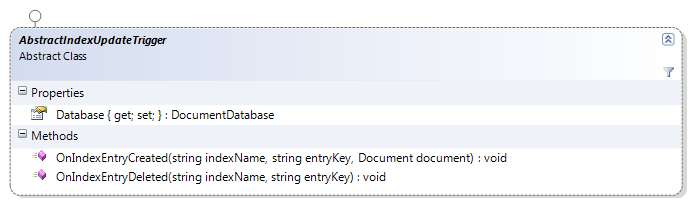

import Admonition from '@theme/Admonition';
import Tabs from '@theme/Tabs';
import TabItem from '@theme/TabItem';
import CodeBlock from '@theme/CodeBlock';
import LanguageSwitcher from "@site/src/components/LanguageSwitcher";
import LanguageContent from "@site/src/components/LanguageContent";

# Index update triggers

An index update trigger is used to do some operations whenever the index is updated. This can be used to notify a 3rd party or keep a static version of the index at a particular point in time.

Index update triggers inherit from AbstractIndexUpdateTrigger:



**Example: creating static snapshot from the indexed document**

    
```
public class SnapshotShoppingCart : AbstractIndexUpdateTrigger
    {
        public override void OnIndexEntryCreated(string indexName, string entryKey, Lucene.Net.Documents.Document document)
        {
            if (indexName != "Aggregates/ShoppingCart")
                return;
            var shoppingCart = JObject.Parse(document.GetField("Aggregate").StringValue());
            var shoppingCartId = document.GetField("Id").StringValue();
    
            var result = Database.Put("shoppingcarts/" + shoppingCartId + "/snapshots/", null, shoppingCart, new JObject(), null);
            document.Add(new Field("Snapshot", result.Key, Field.Store.YES, Field.Index.NOT_ANALYZED));
        }
```

    }

This index works on the [following index](https://ayende.com/blog/4530/raven-event-sourcing) in order to create a static snapshot of the indexed document whenever it is indexed. Note that we use identity insert here (the key we use ends with '/') so we will have documents like this:

* shoppingcarts/12/snapshots/1
* shoppingcarts/12/snapshots/2
* shoppingcarts/12/snapshots/3

This is nice if we want to keep a record of all the changes to the index. Note that we also change the document to store the snapshot key for this particular version.