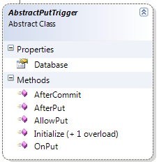

import Admonition from '@theme/Admonition';
import Tabs from '@theme/Tabs';
import TabItem from '@theme/TabItem';
import CodeBlock from '@theme/CodeBlock';
import LanguageSwitcher from "@site/src/components/LanguageSwitcher";
import LanguageContent from "@site/src/components/LanguageContent";

#Put triggers
PUT triggers are classes that inherit the AbstractPutTrigger class:



1. AllowPut gives the trigger the chance to reject the PUT operation.
2. OnPut gives the trigger the chance to modify the document and metadata before the changes are saved.
3. AfterPut gives the trigger the chance to perform operations in the same transaction as the put.
4. AfterCommit gives the trigger the chance to notify external parties about the Put operations.

**Example: Security trigger**

    ```
csharp
public class SecurityTrigger : AbstractPutTrigger
    {
        public override VetoResult AllowPut(string key, JObject document, JObject metadata, TransactionInformation txInfo)
        {
            var doc = Database.Get(key, txInfo);
            if (doc == null) // new document
                return VetoResult.Allowed;
            if (doc.Metadata["Document-Owner"] == null)// no security
                return VetoResult.Allowed;
            if (doc.Metadata["Document-Owner"].Value&lt;string&gt;() == Thread.CurrentPrincipal.Identity.Name)
                return VetoResult.Allowed;
            return VetoResult.Deny("You are not the document owner, cannot modify document");
        }
    
        public override void OnPut(string key, JObject document, JObject metadata, TransactionInformation txInfo)
        {
            if (metadata["Document-Owner"] == null) // user didn't explicitly set it
            {
                // modify the metadata to the current user
                metadata["Document-Owner"] = new JValue(Thread.CurrentPrincipal.Identity.Name);
            }
        }
    }
```

Most of the logic is in AllowPut method, where we check the existing owner (by checking the current version of the document) and reject the update if it if the owner doesn't match.
In the OnPut method, we ensure that the metadata we need is setup correctly.