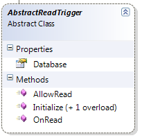

import Admonition from '@theme/Admonition';
import Tabs from '@theme/Tabs';
import TabItem from '@theme/TabItem';
import CodeBlock from '@theme/CodeBlock';
import LanguageSwitcher from "@site/src/components/LanguageSwitcher";
import LanguageContent from "@site/src/components/LanguageContent";

#Read Triggers
Read triggers implement the AbstractReadTrigger interface and allow filtering, modifying and denying document reading and querying capabilities.
Like PUT and DELETE triggers, the read trigger need to handle two operations, allowing the read operation to proceed and modifying the document before it is read by the user.



**Example: Information hiding**

    
```
public override ReadVetoResult AllowRead(JObject document, JObject metadata, ReadOepration operation, TransactionInformation txInfo)
    {
        if(metadata.Value&lt;string&gt;("Document-Owner") == Thread.CurrentPrincipal.Identity.Name)
           return ReadVetoResult.Allowed;
        
        if(operation == ReadOperation.Load)
           return ReadVetoResult.Deny("You don't have permission to read this document");
        else
           return ReadVetoResult.Ignore;
    }
```


In the example above, we only let the owner of a document to read it. You can see that a Read trigger can deny the read to the user (returning an error to the user) or ignoring the read (hiding the presence of the document. You can also make decisions based on whatever that specific document was requested, or if the document was read as part of a query.

**Example: Linking document on the server side**

    
```
public class EmbedLinkDocument : AbstractReadTrigger
    {    
        public override void OnRead(JObject document, JObject metadata, ReadOepration operation, TransactionInformation txInfo)
        {
           var linkName = metadata.Value&lt;string&gt;("Raven-Link-Name");
           var link = metadata.Value&lt;string&gt;("Raven-Link");
           if(link == null)
              return;
           var linkedDocument = Database .Get(link, txInfo);
           document.Add(linkName, linkedDocument.ToJson());
        }
```

    }   

In this case, we detect that a document with a link was requested, and we stitch the document together with its link to create a single document.