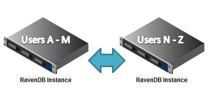

import Admonition from '@theme/Admonition';
import Tabs from '@theme/Tabs';
import TabItem from '@theme/TabItem';
import CodeBlock from '@theme/CodeBlock';
import LanguageSwitcher from "@site/src/components/LanguageSwitcher";
import LanguageContent from "@site/src/components/LanguageContent";

# Mixing Replication and Sharding

Replication and Sharding are two powerful features supported by RavenDB. They are mostly orthogonal to one another, and you can use both replication and sharding together. Where it gets interesting is the deployment decisions that this leads to, which we will explore shortly. 

For simplicity, we will assume that only Users are stored in RavenDB, and that there is a simple sharding 2 node sharding scheme based on the user name (A - M in one node, N - Z in the second node).

## Sharding with dedicated failover nodes

In this setup, we have two nodes holding the users, and two nodes with serve as the slaves for each master. If one of the primary nodes is failing, RavenDB will automatically switch to the replicated copy.

<Admonition type="note" title="">
Should you allow to failover writes to the replicated node? If you do, you need to recover those writes. The usual approach for that is to setup two way replication between the master and slave. Since the slave will be written to only if the master have failed, in essence what this means is that when the master restarts, we will be able to send it all the documents that were written to while it was down. There is a small chance of getting conflicts using this system, if a write occurs on the server as soon as it is up but before replication from the slave have finished.
</Admonition>

You need to either [handle that](https://ravendb.net/docs/server/bundles/replicationconflicts?version=1.0) or to choose to disallow writes while using the master is unavailable, and use the slave just for reads.

## Sharding with internal failover nodes

Another option is to use sharding primarily as a mean of reducing load on the servers, and setup replication between the different nodes without dedicated failover nodes, like so:

<Admonition type="note" title="">
This reduces the number of instances that you use, but it also means that your capacity is limited to what can be stored in a single node. In practice, it means that if there is a failover, all the traffic will be directed to a single node. This may very well lead to a cascading failure scenario, since a single node may not be able to handle all the load for the application.
</Admonition>

Even during normal operation, it puts each node under higher stress, since it needs to handle both normal operation and replicated operations.