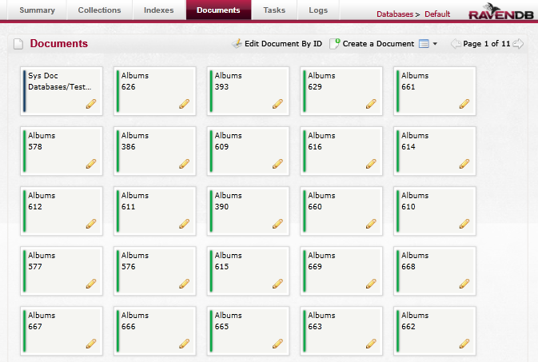
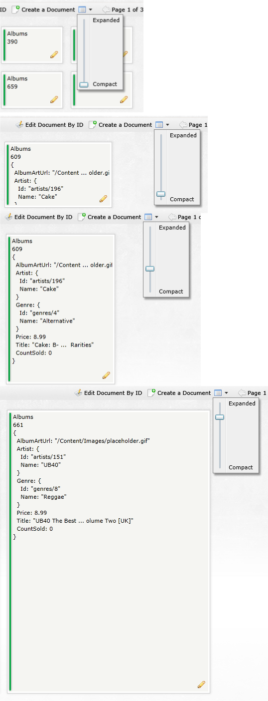
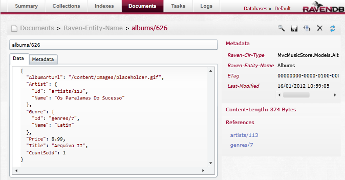

import Admonition from '@theme/Admonition';
import Tabs from '@theme/Tabs';
import TabItem from '@theme/TabItem';
import CodeBlock from '@theme/CodeBlock';
import LanguageSwitcher from "@site/src/components/LanguageSwitcher";
import LanguageContent from "@site/src/components/LanguageContent";

# The Documents Screen

This screen gives an overview of all documents in the RavenDB server instance.

## Documents listing

The documents are loaded from the database, newest first, and displayed with their ID and Collection name - documents from different collections are striped with different colors:

<Admonition type="info" title="Info">
A **Collection** in RavenDB is a group of documents sharing the same entity name. It is not a "database table", but rather a logical way of thinking of document groups.
</Admonition>

Paging buttons are available above the documents list to allow you to go back and forth through it:

Next to that you will find a button allowing you to change the size of the document preview in the listing - from Compact view which only shows the collection name and the document id to Expanded view that will show the data of the document as a JSON string:

Either way, hovering over a document will show a tooltip with the document JSON representation:

## Editing a document

By double clicking on a document in the list, or clicking on the pencil icon on it, you get to the document editing screen.

The document ID - a unique key assigned to each document - is shown at the top of the form, and below that the document in its JSON representation is ready to be edited:

RavenDB saves additional data on each document, such as it's Collection association (`Raven-Entity-Name`), and all that info can be viewed and edited through the metadata tab:

On the top right corner of this screen you will find several buttons:

- Search
- Save changes
- Reformat Document: will remove empty line and fix indentation
- Delete Document: to permanently delete the current document, will prompt before doing the delete
- Refresh: will reload the document from the server

To the right of the form some statistics are shown - the metadata of the current document, formatted, and a list of possible reference found in it. Clicking on a reference will open that document for editing, if it exists in your database.

## Other options

Back in the main listing screen, at the top right corner of the screen you will find 2 additional buttons:  

Clicking the "Edit document by Id" will pop-up an input box, where you can enter the document ID you wish to edit:

If no document exists in the database for the ID you provide you will be redirected to the Documents tab, otherwise the Document edit page will load with the requested document.

Clicking the "Create a Document" button will open the document editing screen, but this time with empty fields. After providing a unique ID for the document and filling some data for it, clicking on Save will create it on the server.

For a new document created through the Studio the `Raven-entity-Name` metadata attribute which sets its collection is set by the text before the '/' in the provided ID (with first letter in capital), so the a document with ID "albums/626" will be assigned to the "Albums" collection.

If you have a a multi-tenant database set up, while browsing the documents in the Default Database tenant you will see one or more special documents titled "Sys Doc" with the names of the available tenants. Do not edit or delete this document - doing so might cause you to lose access to that tenant, although the actual data in it is not deleted.

