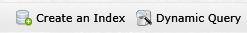
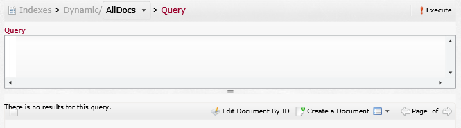
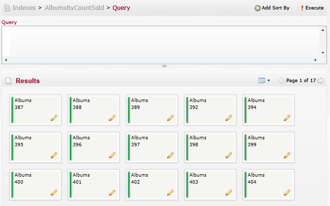
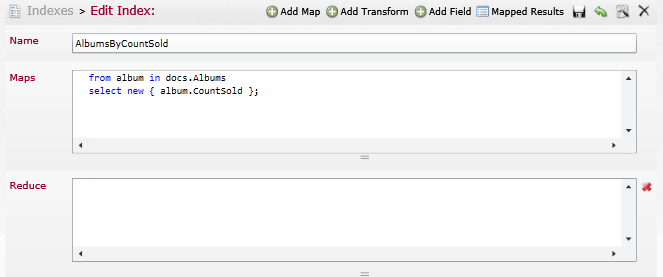

import Admonition from '@theme/Admonition';
import Tabs from '@theme/Tabs';
import TabItem from '@theme/TabItem';
import CodeBlock from '@theme/CodeBlock';
import LanguageSwitcher from "@site/src/components/LanguageSwitcher";
import LanguageContent from "@site/src/components/LanguageContent";

# Indexes
On the top right you have two options

When you choose to create a new index the following page will load  
The Content of this page will be explained [later in this page](#create)  
  

When you choose Dynamic Query the following page will load  
The Content of this page will be explained [later in this page](#query)  
 

In the body of the page you can see a list of the available indexes  
If you click on the index name a query page will load with ability to query the result of the index  
 

If you click on the pencil icon of an index the edit index page will load  
  

### Edit index or Create new index page &lt;a id="create"&gt;&lt;/a&gt;
In both pages the layout is the same  
On the top right you have several buttons  
  
From right to left:  

- Add Map: adds map section to the index  
If you have more the one map you can delete extra maps with the X on the right 

- Add reduce: adds reduce section to the index  
Only one reduce is possible, if you add a reduce the icon from the top will be removed, if the reduce section is deleted (by pressing the X on the right) it will return to the options  
 

- Add transform: adds transform section to the index  
Only one transform is possible, if you add a transform the icon from the top will be removed, if the transform section is deleted (by pressing the X on the right) it will return to the options  
 

- Add Field: adds transform section to the index  
It is possible to add as many fields as you want (you can remove a field by pressing the X)    

- Save: will save the changes to the index
- Undo: will discard all changes made to the index
- Query: will send to the [query page](#query) on the index
- Delete: will delete the index

In the body of the page you have a place for the title of the index and a body for the map.  
Each index must have both a name and a map.  

### Query page &lt;a id="query"&gt;&lt;/a&gt;
In Dynamic query you on the top of the page you can choose if you want to query all the data or a specific collection  

Other then that the layout for dynamic query and index query is the same  
On the top right you have a button to execute the query  
  

At the top of the body you have a space to type your query (with [lucene syntax](https://www.codeproject.com/Articles/29755/Introducing-Lucene-Net))  
At to bottom the results of the query  
 
