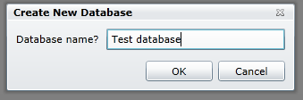

import Admonition from '@theme/Admonition';
import Tabs from '@theme/Tabs';
import TabItem from '@theme/TabItem';
import CodeBlock from '@theme/CodeBlock';
import LanguageSwitcher from "@site/src/components/LanguageSwitcher";
import LanguageContent from "@site/src/components/LanguageContent";

# Multi-Database Support

RavenDB supports multi-tenancy, and the Management Studio provides an easy way to manage multiple tenants from the same UI, and to create new tenants.

<Admonition type="note" title="">
You cannot delete a database using the Management Studio.
</Admonition>

At the top right corner of each screen, by the RavenDB logo, the name of the current tenant you are working against is shown. Clicking on it will open a list of other available tenants, and selecting another one from that list will shift the Studio to working against that tenant.

## Creating a new tenant

When pressing on the link named "Databases" on the to right of each page a new page will load:

On the top right you can create a new database:

After selecting this option a window will pop up and you need to enter a name for the new database.

Each database must have a unique name.

Once you have selected the name a new empty database will be created. The name of the selected database will appear on the top right next the databases link:

Once you have more the one database you can switch between them from any page by clicking on the name of the active database and a list of possible databases will open, click on the database you want to view next.