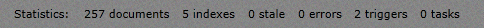
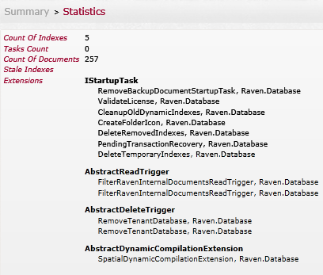

import Admonition from '@theme/Admonition';
import Tabs from '@theme/Tabs';
import TabItem from '@theme/TabItem';
import CodeBlock from '@theme/CodeBlock';
import LanguageSwitcher from "@site/src/components/LanguageSwitcher";
import LanguageContent from "@site/src/components/LanguageContent";

# Statistics

On the bottom of each screen various statistics on the database are shown:

In here you can see:  

- Number of [documents](https://ravendb.net/docs/studio/documents?version=1.0)
- Number of [indexes](https://ravendb.net/docs/studio/indexes?version=1.0)
- Number of stale indexes
- Number of error
- Number of triggers
- Number of tasks waiting to happen

On the statistics page you can see all the above data with addition of the extensions to the database, where you can see when each extension is activated (Startup, read, delete, etc...)

