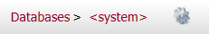
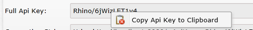

import Admonition from '@theme/Admonition';
import Tabs from '@theme/Tabs';
import TabItem from '@theme/TabItem';
import CodeBlock from '@theme/CodeBlock';
import LanguageSwitcher from "@site/src/components/LanguageSwitcher";
import LanguageContent from "@site/src/components/LanguageContent";

# Using API Keys With RavenDB

Api keys are used when trying to authorize with OAuth.

Here are the steps needed in order to set the api keys:  

1) Open the browser  
2) Navigate to: `http://localhost:{your server port}`  
3) Go to the Databases section and select "System Database" on the top right  
  
4) Go to the settings (press the cog wheel next to the database name)  
  
5) In the Api Keys section Add a new key, select a name, generate a secret and add a database for your database  
  
6) Don't forget to click the "Save Changes" button"  
  

A few tips:  

- In order to set a key to all databases in the database name enter "*" (this will NOT grant access to the system database) 
- To grant access to the system database set the database name to "&lt;system&gt;".

Once all settings are entered give the user the "full api key" (you can right-click on it to copy).  
  

In order to use this api key the user needs to set the api key when settings a new DocumentStore like this:  

<TabItem value="apikeys1" label="apikeys1">
<CodeBlock language="csharp">
{`var store = new DocumentStore
	                       \{
		                       Url = "http://localhost:" + port,
		                       DefaultDatabase = "ApiKeySample",
		                       ApiKey = apiKey
	                       \}.Initialize();
`}
</CodeBlock>
</TabItem>