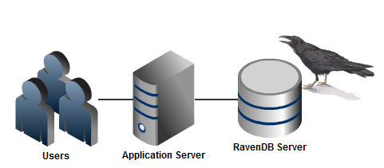

import Admonition from '@theme/Admonition';
import Tabs from '@theme/Tabs';
import TabItem from '@theme/TabItem';
import CodeBlock from '@theme/CodeBlock';
import LanguageSwitcher from "@site/src/components/LanguageSwitcher";
import LanguageContent from "@site/src/components/LanguageContent";

# Bundle: Authorization

The Authorization Bundle extend RavenDB and add document level permissions. The Auth Bundle allows to define permissions for a specific user, a group or using arbitrary tagging. The system is design to be high performance, scalable and flexible. 

## Design Guidelines

Unlike other security systems you may be familiar with (such as RDMBS row level security), the Auth Bundle takes a different approach for securing documents. Instead of having a predefined set of generic operations (READ, WRITE, DELETE) that apply per user or per group, the Auth Bundle allows you to define your own operations. One of the key scenarios when designing the Auth Bundle was supporting multi axis permission systems. What is means is that the Auth Bundle model is much more suited to defining security concerns for business operations, rather than just blanket can do/ can't do approach taken by most other systems.

Consider the following scenario, for a chain of medical clinics:

* Any Nurse can schedule appointments for a Patient.
* Only Patients in the same Clinic can be accessed.
* Only a Doctor can prescribe medicine.

What is interesting here is that the above requirement are both business logic and security requirements. Moreover, we have at least two operations (scheduling an appointment and prescribing medicine) which boils down to a write permission. Obviously, just assigning READ/WRITE permissions will not do. That is what we mean when we consider the Auth Bundle to be a multi axis permission system.

Operations in the Auth Bundle are user defined, so when a nurse tries to schedule an appointment for a patient, we will use the "appointment/schedule" operation, and the write operation would succeed, but if the nurse will try to prescribe medicine, the permission for "medicine/prescribe" would fail.

The Auth Bundle performs the following function:

* For queries, filter out any documents that the user doesn't have permission for the current operation.
* For loading a document by key, raise an error if the user doesn't have permission for the current operation.
* For writing/deleting, raise an error if the user doesn't have permission for the current operation.

The most important assumption that the Auth Bundle makes that we can trust the client not to lie about whose user it is executing a certain operation. That one assumes the following deployment scenario:

In other words, only the application server can talk to the RavenDB server and the application server is running trusted code. To be clear, this design does not apply if users can connect directly to the database and lie about who they are. 

## Operations

Unlike most security systems, the Auth Bundle isn't limited to a set of predefined operations (Read, Write, Delete) but is actually more focused on multi axis of permissions. An operation on a document may be accessible to a user in one context and inaccessible in another.

For example, let us take the scenario of a medical clinic:

* A Nurse can schedule an appointment to a Patient.
* A Doctor can authorize hospitalization.
* Viewing Patient details is allowed only to users of the Patient's Clinic.

Note that a Nurse is authorized to modify a Patient document (to schedule an appointment), but only under certain circumstances. In systems that only allow Read,Write,Delete permissions, you would have to give the Nurse permissions to write to the Patient document and handle the logic of the different scenarios using business logic.

The Auth Bundle allows a much richer permissions system.

We can define the first two requirements in the above scenario using the following:

<TabItem value="authorization1" label="authorization1">
<CodeBlock language="csharp">
{`// Allow nurses to schedule appointment for patients
session.Store(
	new AuthorizationRole
		\{
			Id = "Authorization/Roles/Nurses",
			Permissions =
				\{
					new OperationPermission
						\{
							Allow = true, 
							Operation = "Appointment/Schedule", 
							Tags = new List<string> \{ "Patient" \}
						\}
				\}
		\});

// Allow doctors to authorize hospitalizations
session.Store(
	new AuthorizationRole
		\{
			Id = "Authorization/Roles/Doctors",
			Permissions =
				\{
					new OperationPermission
						\{
							Allow = true, 
							Operation = "Hospitalization/Authorize", 
							Tags = new List<string> \{ "Patient" \}
						\}
				\}
		\});
`}
</CodeBlock>
</TabItem>

And the last is defined using:

<TabItem value="authorization2" label="authorization2">
<CodeBlock language="csharp">
{`// Associate Patient with clinic
session.SetAuthorizationFor(session.Load<Patient>("Patients/MaryMallon"), new DocumentAuthorization \{ Tags = \{ "Clinics/Kirya", "Patient" \} \});

// Associate Doctor with clinic
session.Store(
	new AuthorizationUser
		\{
			Id = "Authorization/Users/DrHowser",
			Name = "Doogie Howser",
			Roles = \{ "Authorization/Roles/Doctors" \},
			Permissions =
				\{
					new OperationPermission
						\{
							Allow = true, 
							Operation = "Patient/View", 
							Tags = new List<string> \{ "Clinics/Kirya" \}
						\},
				\}
		\});
`}
</CodeBlock>
</TabItem>

Note that we have multiple axis of permissions for the same document.

## Permissions

Permissions are pretty simple, they allow or deny access to a document for a specific operation. Permissions have the following properties:

* Permissions can be prioritized, so permission at a higher priority will override permission at a lower priority.
* When there are an allow permission and a deny permission at the same priority, the deny permission will override the allow permission.
* If there isn't a permission that allow the operation, the operation is denied.

## Tagging entities
Entity tagging is one of the ways in which you can provide additional information for the Auth Bundle. Let us look at how the "Hospitalization/Authorize" permission is set up for our patient, Mary.

Mary is tagged as a Patient, so when DrHowser tries to authorize hospitalization for her, the following things happen:

* The set of permissions associated with the user itself are scanned. There is nothing there for "Hospitalization/Authorize", however.
* Then the role document is inspected, where we find that there exists a permission for "Hospitalization/Authorize" for documents tagged with "Patient".
* That tag matches the tag on the patient document.

Authorization is given and the operation can proceed.

## Users

The Auth Bundle uses the AuthorizationUser document to define a user. Please note that as long as your user document matches or extends the following document format, you can use your own user document, no necessarily the one specified here. 

## Hierarchies

One last concept to remember before we move to the concrete usage discussion. Tags, operations and roles are hierarchical. But the way they work is quite different.

* For Tags, having a permission on "Clinics" will match for document tagged with "Clinics/Kirya".
* For Operations, having a permission for "Hospitalization" will match for operation "Hospitalization/Authorize"
* For Roles, if you are a member of "Doctors/Pediatrician", you are also a member of "Doctors".

## Installation
To install the Auth Bundle on the server side, simply place the Raven.Bundles.Authorization.dll in the Plugins directory.

To use the Auth Bundle on the client side, you need to reference:

* Raven.Bundles.Authorization.dll
* Raven.Client.Authorization.dll

And import the "Raven.Client.Authorization" namespace to include the authorization extension methods.

## Usage
The Auth Bundle usage on the client side is limited to three methods:

* SetAuthorizationFor - which setup permissions and tags for a specific document.
* GetAuthorizationFor - which allows you to read what permission and tags were set on a specific document.
* SecureFor - setup which user and operation are being performed.

For example, here is the code for authorization hospitalization:

<TabItem value="authorization3" label="authorization3">
<CodeBlock language="csharp">
{`session.SecureFor("Authorization/Users/DrHowser", "Hospitalization/Authorize");
var mary = session.Load<Patient>("Patients/MaryMallon");
mary.AuthorizeHospitalization();
session.SaveChanges();
`}
</CodeBlock>
</TabItem>

If the user doesn't have permissions to authorize hospitalization, an error will be raised when the change is persisted to the database in the SaveChanges call.

## Applying permissions
The response for denying an operation are worth some note.

* When performing a query over a set of documents, some of which we don't have the permission for under the specified operation, those documents are filtered out from the query.
* When loading a document by id, when we don't have the permission to do so under the specified operation, an error is raised.
* When trying to write to a document (either PUT or DELETE), when we don't have the permission to do so under the specified operation, an error is raised.

## Results from indexes
While documents queried using an index will be filtered according to the security rules, there isn't any filtering for fetching the data done directly from the index. Fetching data from the index requires an explicit action (marking the field as stored), so it isn't usually a concern, but be aware that even with the Auth Bundle, if you are storing fields in the indexes, they can be read regardless of the authorization setup you have.

For much the same reason, the result of map/reduce indexes cannot be secured, and will have no filtering applied to them.