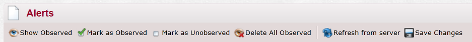

import Admonition from '@theme/Admonition';
import Tabs from '@theme/Tabs';
import TabItem from '@theme/TabItem';
import CodeBlock from '@theme/CodeBlock';
import LanguageSwitcher from "@site/src/components/LanguageSwitcher";
import LanguageContent from "@site/src/components/LanguageContent";

# Alerts
In the alerts page you can see alerts sent from the server (at the moment only errors in periodic backup will send alerts).  

On the top you have the following toolbar:  
  

- Show Observed - This is a toggle button that will change to "Hide Observed" on click, this will determine where observed alerts will be shown or not.
- Mark as Observed - Will mark all current alerts as observed.
- Mark as Unobserved - Will mark all current alerts as unobserved.
- Delete All Observed - Remove all observed items from the list.
- Refresh from server - Refreshed from database, pay attention that if you make changes and not save them when you refresh from the server you will lose your changes.  
- Save Changes - Updated the list in the server according to the changes you have made.