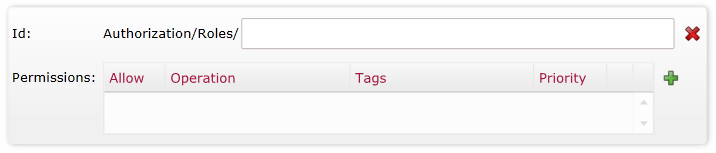
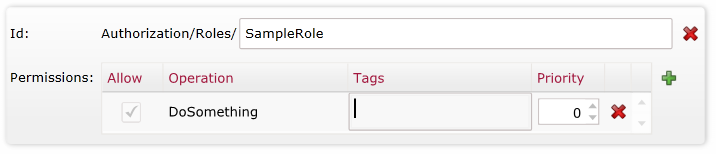
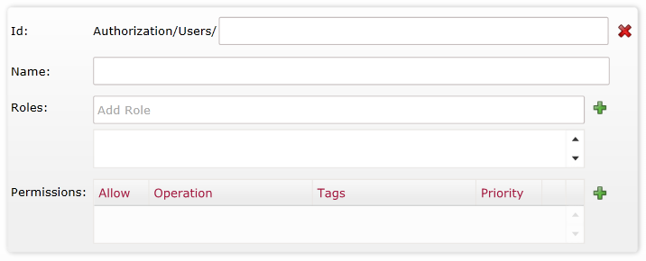

import Admonition from '@theme/Admonition';
import Tabs from '@theme/Tabs';
import TabItem from '@theme/TabItem';
import CodeBlock from '@theme/CodeBlock';
import LanguageSwitcher from "@site/src/components/LanguageSwitcher";
import LanguageContent from "@site/src/components/LanguageContent";

# Bundle: Authorization
When creating a database, if you want to use the versioning bundle you need to select it in the database creation window:  
  

After you press "Next" you will get the following page:  
  
Pay attention the if you select other bundles that has settings to set they will all appear here in the list on the left.  

In here you have 2 tabs, for "Users" and for "Roles"

## Authorization Roles
After you add an Authorization Role the following box will be added:  
  
In here you name the role and set permissions for it:  
  
With the "+" button you can add additional permissions.

## Authorization Users
After you add an Authorization User the following box will be added:  
  
In here you can edit all the permissions for the user as well as add roles to the user

After you create the database you can always edit these values in the settings section by pressing the cog wheel on the top right next to the database name:  
  

You can read more information about the Authorization Bundle [here](../../../server/extending/bundles/authorization?version=2.0.mdx)