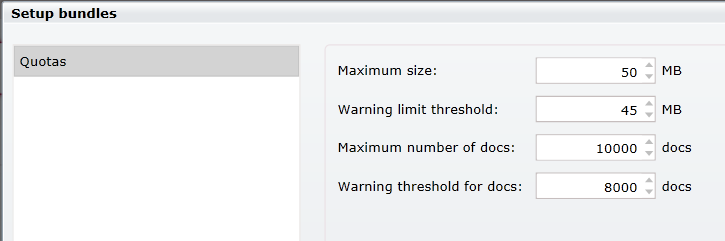

import Admonition from '@theme/Admonition';
import Tabs from '@theme/Tabs';
import TabItem from '@theme/TabItem';
import CodeBlock from '@theme/CodeBlock';
import LanguageSwitcher from "@site/src/components/LanguageSwitcher";
import LanguageContent from "@site/src/components/LanguageContent";

# Bundle: Quotas
When creating a database, if you want to use the quotas bundle you need to select it in the database creation window:  
  

After you press "Next" you will get the following page:  
  
Pay attention the if you select other bundles that has settings to set they will all appear here in the list on the left.  

In here you can set several parameters for the database:  
- Maximum size: Limit the size of the database (in MB).
- Warning limit threshold: Set on which database size you will get a warning (in MB).
- Maximum number of docs: Limit the number of documents the database can hold.
- Warning threshold for docs: Set the number of documents that when reached will warn the user.  

After you create the database you can always edit these values in the settings section by pressing the cog wheel on the top right next to the database name:  
  

You can read more information about the Quotas Bundle [here](../../server/extending/bundles/quotas.mdx)