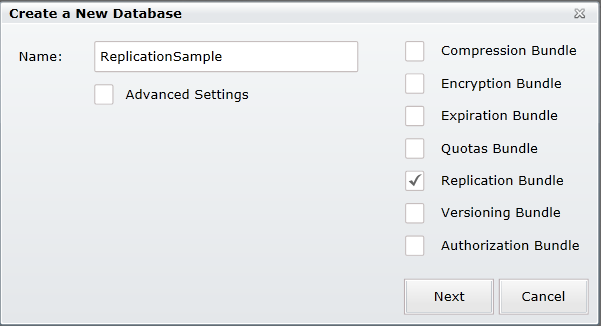

import Admonition from '@theme/Admonition';
import Tabs from '@theme/Tabs';
import TabItem from '@theme/TabItem';
import CodeBlock from '@theme/CodeBlock';
import LanguageSwitcher from "@site/src/components/LanguageSwitcher";
import LanguageContent from "@site/src/components/LanguageContent";

# Bundle: Replication
When creating a database, if you want to use the replication bundle you need to select it in the database creation window:  
  

After you press "Next" you will get the following page:  
  
Pay attention the if you select other bundles that has settings to set they will all appear here in the list on the left.  

In here you can set the replications, press the "Add Replication" do add another replication settings.  
For each replication you can set the following settings:  
- Disable: This option will disable the replication but not delete it.
- Url: Set the Url for the replication destination.
- Client Visible Url: Set the Url the will be visible for the client.
- Database: Set the database you want to replicate to.
- User Name, Password, Domain, ApiKey: If the other server/database requires permissions to connect to it here you can set those parameters.  
- Skip failover: Set whether to failover to the replication
- Transitive Replication: Can select between "Changed Only" and "Changed and replicated"

After you create the database you can always edit these values in the settings section by pressing the cog wheel on the top right next to the database name:  
  

Sometimes with replication we can run into conflicts, in this case you will see in the documents tab in the replication database several documents:  
  
As you can see we have the "test/1" document, but we also have two documents that start with "test/1/conflicts" this tells us that some conflict happened during replication, in order to resolve this you can try to edit the original document (in our case the "test/1" document)  
When you enter the document you will see the edit page with a suggested document for resolving the conflict:  
  
in order to resolve the conflict edit the document (make sure to remove the "conflict start" and "conflict end" before saving)  

For a complete walkthrough of replication in the studio go [here](../../studio/bundles/replication-walkthrough.mdx)  
You can read more information about the Replication Bundle [here](../../server/scaling-out/replication?version=2.0.mdx)