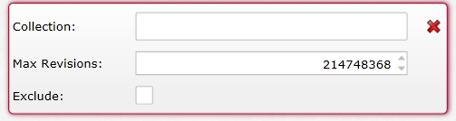
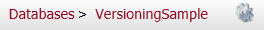

import Admonition from '@theme/Admonition';
import Tabs from '@theme/Tabs';
import TabItem from '@theme/TabItem';
import CodeBlock from '@theme/CodeBlock';
import LanguageSwitcher from "@site/src/components/LanguageSwitcher";
import LanguageContent from "@site/src/components/LanguageContent";

# Bundle: Versioning
When creating a database, if you want to use the versioning bundle you need to select it in the database creation window:  
  

After you press "Next" you will get the following page:  
  
Pay attention the if you select other bundles that has settings to set they will all appear here in the list on the left.  

In here you can set the versioning, press the "Add Versioning" do add another versioning settings.  
You will always have the default versioning here, with it you can edit the default "Max Revisions" number and choose to exclude it.  

When you add a new versioning an additional box will be added:  
  
When you go to edit the "Collection" box you will get a dropdown with the names of the available collections (this happens only when you already have documents in the database:  
  

After you create the database you can always edit these values in the settings section by pressing the cog wheel on the top right next to the database name:  
  

You can read more information about the Versioning Bundle [here](../../../server/extending/bundles/versioning?version=2.0.mdx)