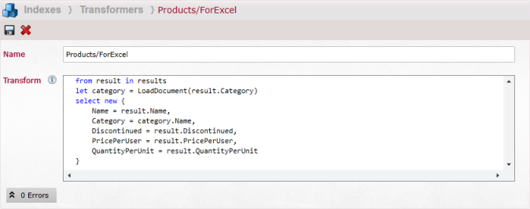

import Admonition from '@theme/Admonition';
import Tabs from '@theme/Tabs';
import TabItem from '@theme/TabItem';
import CodeBlock from '@theme/CodeBlock';
import LanguageSwitcher from "@site/src/components/LanguageSwitcher";
import LanguageContent from "@site/src/components/LanguageContent";

# Excel integration

To integrate with Excel application we will need following items:   
1. Some data (built-in Northwind sample data in this example).   
2. [Index](../client-api/querying/static-indexes/defining-static-index.mdx) that we will query against (in this example we will use default `Raven/DocumentsByEntityName` index).   
3. [Transformer](../client-api/querying/results-transformation/result-transformers.mdx) (optional - just to shape up the results).   



To query a database for `Product` using our `Raven/DocumentsByEntityName` index then transforming the results with `Products/ForExcel` transformer and formating them to excel we need to visit following url:   

```plain 
curl -X GET http://localhost:8080/streams/query/Raven/DocumentsByEntityName?query=Tag:Products&resultsTransformer=Products/ForExcel&format=excel
```


Now to push it to Excel we need to create new spreadsheet and import data `From Text`.


Then in a Open File Dialog we paste our querying URL.


Next, the Import Wizard will show up where we can adjust our import settings (don't forget to check 'Comma' as a desired delimiter).


Finally we need to select where we would like the imported data to go:


As a result of previous actions, the spreadsheet data should look like:


Now we must tell Excel to to refresh data, to do it click on Connections in Data tab:


And you will see something like this:


Go to Properties and:   
1. **uncheck** Prompt for file name on refresh.   
2. **check** Refresh data when opening the file.   


Finally you can close the file, change something in the database and reopen it and you will see new values.