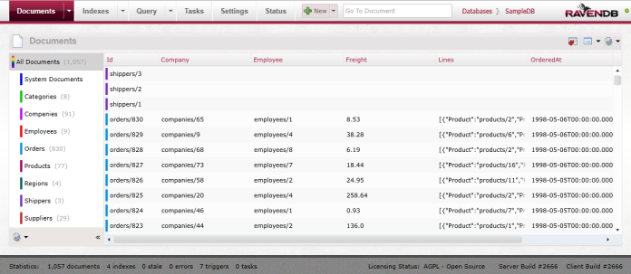

import Admonition from '@theme/Admonition';
import Tabs from '@theme/Tabs';
import TabItem from '@theme/TabItem';
import CodeBlock from '@theme/CodeBlock';
import LanguageSwitcher from "@site/src/components/LanguageSwitcher";
import LanguageContent from "@site/src/components/LanguageContent";

# Basic concepts

RavenDB is a database technology based on a client-server architecture. Data is stored on a server instance and data requests from one or more clients are made to that instance.

Requests to the server are made using either:

* The [.NET Client API](../client-api.mdx) - available to any .NET or Silverlight application
* The [RESTful API](../http-api.mdx) - directly accessing the RESTful API exposed by the server

If you are a .NET developer, using the Client API is the easiest way for you to work with RavenDB, as it provides a great amount of features and a very slick API.

The RESTful API makes RavenDB accessible from other platforms like AJAX queries in web pages or non-Windows applications written in Ruby on Rails, for example.

## The RavenDB server

### Launching a server instance

A RavenDB server instance can be instantiated in several ways:

* Running the Raven.Server.exe console application (located under `/Server/` in the build package).

* Running RavenDB as a service.

* Integrating RavenDB with IIS on your Windows based server.

* Embedding the server in your application.

The various deployment options are discussed in more details in the [Server side section](..\server.mdx).

To jump-start your learning process, it is sufficient that you 

1. Download the [latest stable build](https://ravendb.net/download)
2. Unzip it to a folder
3. Run \\Server\\Raven.Server.exe

You should see a screen like this:

Notice that a port for the server to listen on has already been automatically selected for you, and a data directory has been created and is ready to store your data. This is RavenDB in debug mode.

As long as this window stays open, the RavenDB server is running. Pressing Enter will terminate the server - new requests will no longer be processed, but all data will be persisted in the data directory.

### Storage types

RavenDB currently supports 2 types of storage engines, both of which are completely transactional and fail safe:

* Esent
* Munin.

Esent is a native embeddable database engine which is part of Windows, and maintained by Microsoft.

Munin is written entirely in managed code specifically for its use as part of RavenDB. 

While Munin is useful for testing and temporary in-memory tasks, at this stage only Esent is supported for production usage.

## Documents, Collections and Document unique identifiers

A single data entity in RavenDB is called a _Document_ and all Documents are persisted in RavenDB as [JSON documents](http://json.org).

The JSON format was selected because:

* It can store hierarchies
* It is human readable
* It is as minimalistic as it gets

Every document has MetaData attached to it.  By default, this MetaData only contains data that is used internally by RavenDB (for example - the `Raven-Entity-Name` attribute which stores the entity type for the document).

A _Collection_ is a set of Documents sharing the same RavenDB entity type. It is not a "database table", but rather a logical way of thinking of document groups. A Collection is an entirely virtual construct that has no physical meaning to the database.

With RavenDB, each document has its own unique global ID, in the sense that if one was trying to store two different entities under the same id (`users/1` for example) - the second write will overwrite the first one without any warning.

The convention in RavenDB is to have a document ID that is a combination of the collection name and the entity's unique id within the collection, i.e. `users/1`. This convention is enforced by default within RavenDb by pluralizing the name of the object class being saved, and adding an auto-incremented number to it. However, this document ID convention is not mandatory: document IDs are independent of the entity type, and therefore don't have to contain the name of the collection they are assigned to.

## The RavenDB Management Studio

Every RavenDB server instance is manageable via a remotely accessible Silverlight application - The RavenDB Management Studio.

It can be accessed by pointing your favorite browser to the address (and port) the server is listening on (this is :8080 by default).

[Here](..\studio.mdx) is where we discuss the Studio and how to use it in depth.

This is what the RavenDB Management Studio looks like:

