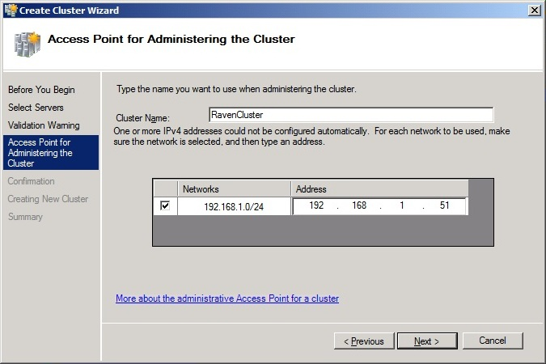
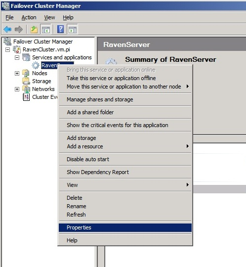
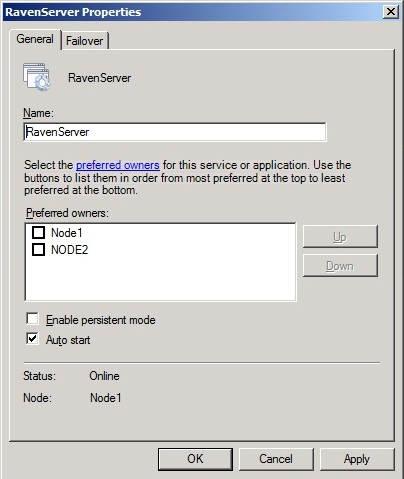
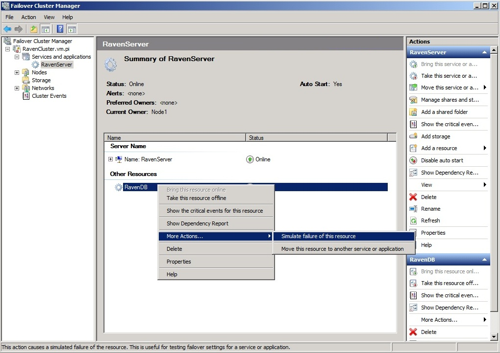

import Admonition from '@theme/Admonition';
import Tabs from '@theme/Tabs';
import TabItem from '@theme/TabItem';
import CodeBlock from '@theme/CodeBlock';
import LanguageSwitcher from "@site/src/components/LanguageSwitcher";
import LanguageContent from "@site/src/components/LanguageContent";

#Windows Clustering

<Admonition type="info" title="">
Windows Clustering feature is only available in the Enterprise Edition.
</Admonition>

In order to ensure RavenDB high availability you can run it on a failover cluster.

## Requirements
* Windows Server 2008
* Failover Cluster Manager snap-in installed
* Storage Area Network (SAN) configured

## Configuring RavenDB service
Execute the following steps on every cluster node:

1. If RavenDB isn't installed as a service follow [this link](https://ravendb.net/docs/server/deployment/as-a-service) in order to do it
2. Stop RavenDB service by executing the following command on the command line: Raven.Server.exe /stop
3. In the Raven.Server.exe.config file set up Raven/DataDir to the SAN

*Note*: A failover cluster will take care of working RavenDB. If the failure take place on one of the cluster nodes then a failover cluster will start RavenDB service immediately. So it's important that RavenDB instance on every node should use the same data directory placed on the SAN. 

## Creating failover cluster

1. Go to Start -&gt; Administrative Tool -&gt; Failover Cluster Manager
2. Select Create a cluster option from context menu  

3. Go through the wizard   

4. Add cluster nodes  

5. Validate a cluster configuration  

6. Validation Wizard will be shown  

7. Run all test to make sure that nodes are configured properly  

8. Click *Next*  

9. Wait for validation finish  

10. Name a cluster and assign IP address for it  

11. Confirm and finish next steps  

## Adding RavenDB as a Generic Service resource

1. Right click on *Services and applications* of newly created cluster and choose *Configure a Service or Application...* option from context menu  

2. Go through the High Availability Wizard  

3. Choose Generic Service  

4. Select RavenDB service  

5. Type the cluster service name and assign the IP address under which RavenDB will be available  

6. RavenDB has been already configured on every node to keep data in SAN, so no storage is needed here. Click *Next*  

7. Click *Next*  

8. Summary screen. Click *Finish*  

<Admonition type="info" title="Windows Authentication usage" id="windows-authentication-usage" href="#windows-authentication-usage">
In a clustered environment a host can have more than one name associated. That can cause problems for Kerberos.
If you are going to use Windows Authentication then use static IP addresses and add a DNS A record for RavenDB.
</Admonition>

## Summary

* After click on a service name in a cluster tree you will see RavenDB service information  

* Service properties  

	* General options  

	* Failover options  

* Failure simulation  
 1. Right click on RavenDB resource and choose *Simulate failure of this resource* 

 2. During failover the resource has been moved to a different node and is in pending mode  

 3. Failover succeeded  
