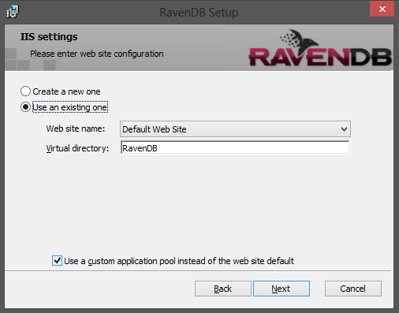
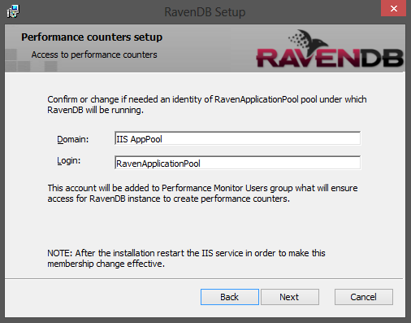

import Admonition from '@theme/Admonition';
import Tabs from '@theme/Tabs';
import TabItem from '@theme/TabItem';
import CodeBlock from '@theme/CodeBlock';
import LanguageSwitcher from "@site/src/components/LanguageSwitcher";
import LanguageContent from "@site/src/components/LanguageContent";

#Installer

Since version 2.5 the installation of RavenDB can be accomplished by using a GUI installer. The setup wizard will guide you through an installation process where you just need to
select the type of an installation and provide configuration options.


## Target environment

You need to choose what kind of the environment you are targeting. The licensing requirements are different depending on the selected option:

* Production / Test - you have to provide a valid license in next step,
* Development - no license is required.

## Installation type

You can install the RavenDB either as a Windows service or as IIS application. Next steps will guide you through a configuration of a chosen deployment strategy. 

## Windows Service configuration

The configuration of the RavenDB service is straight-forward. You only have to provide the name and the port number of the service.


## IIS Application configuration

The configuration of RavenDB run on IIS requires you to go throught a few screens. 

### Web site
In the first dialog you need to enter a web site configuration. You have here two possibilities:

* Create a new web site
* Use an existing one

If you choose first option you will need to fill up the following fields:


If you decided to use the already existing site you just need to choose which one:



The _Virtual Directory_ field can be empty. Then it means that RavenDB will be installed at the root of the web site.

Optionally you can select a checkbox to configure a custom application pool for RavenDB application instead of using the default one configured for the web site.

### Application Pool (optional)

This optional dialog (shown when the checkbox on the previous screen was selected) allows you to set up a custom application pool. As previously you can either create a new or use an existing one.


## Performance counters

The next screen is to configure permissions of the application pool user to the [performance counters access](../administration/perf-counters.mdx). This is needed to ensure that RavenDB hosted by IIS
will be able to create own counters and provide performance stats there.



## Upgrade

The RavenDB installer supports upgrades. The previously used settings (like a service name or an installation path) will be recovered by the wizard. The installation process first will 
automatically remove the old version and then will install the new one.

## Uninstall

Uninstallation can be accomplished by _Programs and Features_ in _Control Panel_ . Only the files created during an installation process will be removed, so all of database data will remain untouched on a disk.


## Quiet mode installation from command line

The RavenDB installer can also be run from a command line with administrative privileges. In order to do that you will have to specify all required installation
settings. The following command shows the dialog with available options:

```json 
ravendb-[version].exe -help
```

Below there is a command which installs RavenDB as a windows service:

```json 
ravendb-[version].exe /quiet /log C:\Temp\raven_log.txt /msicl "RAVEN_TARGET_ENVIRONMENT=DEVELOPMENT TARGETDIR=C:\ INSTALLFOLDER=C:\RavenDB RAVEN_INSTALLATION_TYPE=SERVICE REMOVE=IIS ADDLOCAL=Service"
```

The list of RavenDB specific properties:

* &lt;em&gt;RAVEN_INSTALLATION_TYPE&lt;/em&gt; - available options: SERVICE or IIS (quiet mode instalation on IIS is not recommended)
* &lt;em&gt;RAVEN_TARGET_ENVIRONMENT&lt;/em&gt; - available options: PRODUCTION (default), DEVELOPMENT
* &lt;em&gt;RAVEN_LICENSE_FILE_PATH&lt;/em&gt; - a full path to the license file
* &lt;em&gt;RAVEN_DATA_DIR&lt;/em&gt; - data directory (default: ~\Data)
* &lt;em&gt;RAVEN_INDEX_DIR&lt;/em&gt; - indexes location (default: ~\Data\Indexes)
* &lt;em&gt;SERVICE_NAME&lt;/em&gt; - default: RavenDB
* &lt;em&gt;SERVICE_PORT&lt;/em&gt; - default: 8080