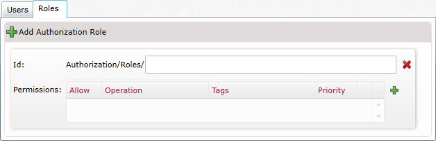
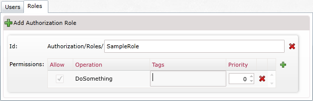
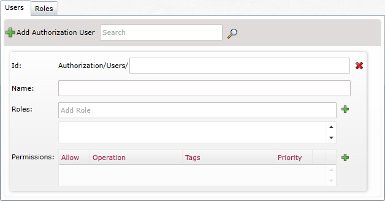

import Admonition from '@theme/Admonition';
import Tabs from '@theme/Tabs';
import TabItem from '@theme/TabItem';
import CodeBlock from '@theme/CodeBlock';
import LanguageSwitcher from "@site/src/components/LanguageSwitcher";
import LanguageContent from "@site/src/components/LanguageContent";

# Bundle: Authorization

When creating a database, if you want to use the versioning bundle you need to select it in the database creation window:  

  

After pressing "Next" your database will be created and authorization bundle enabled. To configure authorization bundle, please access bundle configuration view through database settings.    

  

## Authorization Roles

After you add an Authorization Role the following box will be added:  
  
In here you name the role and set permissions for it:  
  
With the "+" button you can add additional permissions.

## Authorization Users

After you add an Authorization User the following box will be added:  
  
In here you can edit all the permissions for the user as well as add roles to the user

<Admonition type="info" title="">
You can read more about the Authorization Bundle in [here](../../server/extending/bundles/authorization.mdx).
</Admonition>
