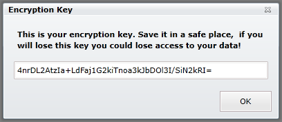

import Admonition from '@theme/Admonition';
import Tabs from '@theme/Tabs';
import TabItem from '@theme/TabItem';
import CodeBlock from '@theme/CodeBlock';
import LanguageSwitcher from "@site/src/components/LanguageSwitcher";
import LanguageContent from "@site/src/components/LanguageContent";

# Bundle: Encryption

When creating a database, if you want to use the encryption bundle you need to select it in the database creation window:  
  

After pressing "Next" you will get the following page:  
  

In here an auto-generated key is suggested to you, if you wish to enter a key for your own you can change it.  
Make sure you backup this key!  

In Addition you can set the encryption algorithm:  
  

You can also choose if you want to encrypt the indexes as well (selected by default)

After you create the database, a window with the selected key will appear, this is your last chance to backup the key:  
  

<Admonition type="info" title="Info">
You can read more about the Encryption Bundle in [here](../../server/extending/bundles/encryption.mdx).
</Admonition>
