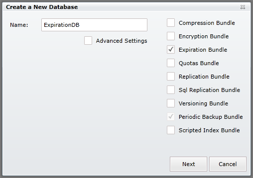

import Admonition from '@theme/Admonition';
import Tabs from '@theme/Tabs';
import TabItem from '@theme/TabItem';
import CodeBlock from '@theme/CodeBlock';
import LanguageSwitcher from "@site/src/components/LanguageSwitcher";
import LanguageContent from "@site/src/components/LanguageContent";

# Bundle: Expiration

When creating a database, if you want to use the expiration bundle you need to select it in the database creation window:  
  

After pressing "Next" your database will be created and expiration functionality enabled.

<Admonition type="info" title="">
You can read more about the Expiration Bundle in [here](../../server/extending/bundles/expiration.mdx).
</Admonition>