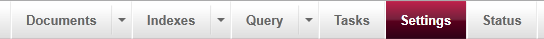
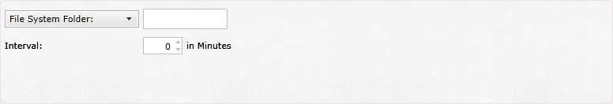
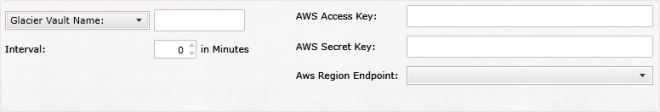

import Admonition from '@theme/Admonition';
import Tabs from '@theme/Tabs';
import TabItem from '@theme/TabItem';
import CodeBlock from '@theme/CodeBlock';
import LanguageSwitcher from "@site/src/components/LanguageSwitcher";
import LanguageContent from "@site/src/components/LanguageContent";

# Bundle: Periodic Backup

In order to enable `Periodic Backup` you need to enter database settings by pressing `Settings` on a top navigation panel.   
  

Once there select the "Periodic Backup" option:  
  

By default backup is not configured and disabled. To activate it press **Activate Periodic Backup**, this will activate the backup settings where you will be able to choose your backup type and configure it properly.
  

Available backup types:

  

- **File System Folder** where you will need to specify:
 - backup path   
 - interval  

  
 
- **Glacier Vault** or **S3 Bucket** with following configuration options:
 - name of the vault or bucket
 - AWS Access and Secret keys
 - AWS Region
 - interval  

  
 
- **Azure Storage** with following fields to fill:
 - name of the storage   
 - Azure Storage Account and Key
 - interval

  
