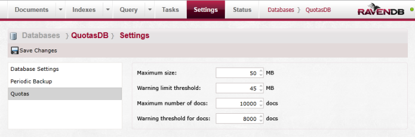

import Admonition from '@theme/Admonition';
import Tabs from '@theme/Tabs';
import TabItem from '@theme/TabItem';
import CodeBlock from '@theme/CodeBlock';
import LanguageSwitcher from "@site/src/components/LanguageSwitcher";
import LanguageContent from "@site/src/components/LanguageContent";

# Bundle: Quotas

If you want to use `Quotas Bundle` then you must select it from the bundle list during the database creation:   
  

After pressing "Next" you will get the following page:  
  

<Admonition type="info" title="">
On the left side of the `Bundle Setup` dialog you will see a list of all selected bundles that require additional configuration.
</Admonition>

In quotas settings you can set several parameters for the database:  

- **Maximum size**: Limit the size of the database (in MB).
- **Warning limit threshold**: Set on which database size you will get a warning (in MB).
- **Maximum number of docs**: Limit the number of documents the database can hold.
- **Warning threshold for docs**: Set the number of documents that when reached will warn the user.  

Bundle settings can always be adjusted in the database settings view, which you can access from top panel.   
  

<Admonition type="info" title="">
You can read more information about the Quotas Bundle [here](../../server/extending/bundles/quotas.mdx)
</Admonition>
