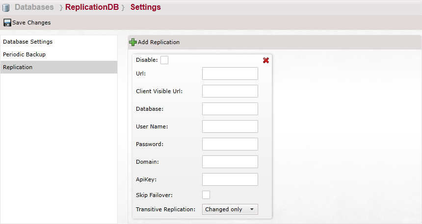
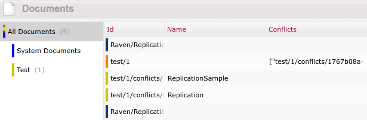

import Admonition from '@theme/Admonition';
import Tabs from '@theme/Tabs';
import TabItem from '@theme/TabItem';
import CodeBlock from '@theme/CodeBlock';
import LanguageSwitcher from "@site/src/components/LanguageSwitcher";
import LanguageContent from "@site/src/components/LanguageContent";

# Bundle: Replication

If you want to use `Replication Bundle` then you must select it from the bundle list during the database creation:   
  

After pressing "Next" your database will be created (`Setup Bundle` dialog might appear if you selected other bundles that require additional configuration).

To access your replication settings and add a replication you must go to database **Settings** using navigation panel at top:
  

Here you can configure replication settings by pressing `Add Replication`.    
  

For each replication you can set the following settings:   
  
- **Disable**: This option will disable the replication but not delete it.
- **Url**: Set the replication destination url.
- **Client Visible Url**: Set the Url the will be visible for the client.
- **Database**: Set the destination database name.   
- **User Name**, **Password**, **Domain**, **ApiKey**: If the other server/database requires permissions to connect to it here you can set those parameters.  
- **Skip Failover**: Set whether to failover to the replication
- **Transitive Replication**: Can select between "Changed Only" and "Changed and replicated"

Sometimes with replication we can run into conflicts, in this case you will see in the documents tab in the replication database several documents:  
  
As you can see we have the "test/1" document, but we also have two documents that start with "test/1/conflicts" this tells us that some conflict happened during replication, in order to resolve this you can try to edit the original document (in our case the "test/1" document)  
When you enter the document you will see the edit page with a suggested document for resolving the conflict:  
  
in order to resolve the conflict edit the document (make sure to remove the "conflict start" and "conflict end" before saving)  

<Admonition type="info" title="Info">
For a complete walkthrough of replication in the studio go [here](replication-walkthrough)
</Admonition>

<Admonition type="info" title="Info">
You can read more information about the Replication Bundle [here](../../server/scaling-out/replication.mdx)
</Admonition>