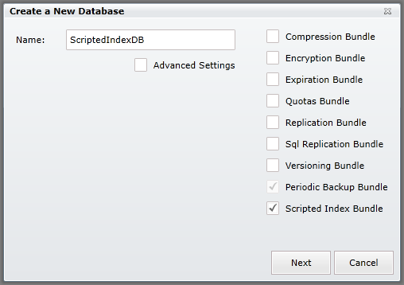
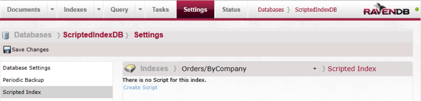
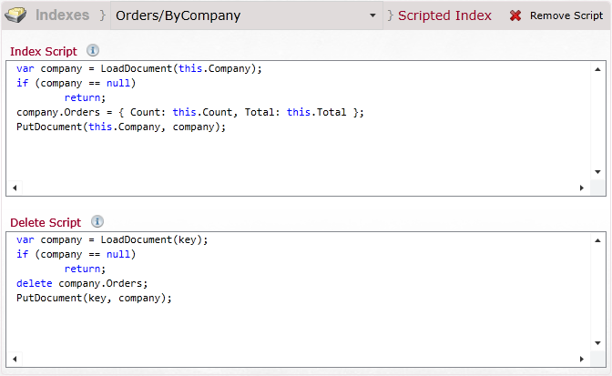

import Admonition from '@theme/Admonition';
import Tabs from '@theme/Tabs';
import TabItem from '@theme/TabItem';
import CodeBlock from '@theme/CodeBlock';
import LanguageSwitcher from "@site/src/components/LanguageSwitcher";
import LanguageContent from "@site/src/components/LanguageContent";

# Bundle: Scripted Index Results

When creating a database, if you want to use the scripted index results bundle you need to select it in the database creation window:  
  

After pressing "Next" your database will be created so you will be able to configure the scripted index results. To do so, you need to enter database settings using the top navigation panel.
  

On the left you will notice a 'Scripted Index' tab where you be able to configure scripts for each desired index.
  

## Example

<Admonition type="info" title="">
Below walktrough is a Studio equivalent of the example described in details [here](../../server/extending/bundles/scripted-index-results.mdx#example)
</Admonition>

To attach our `Orders/ByCompany` index results within company itself we must add two scripts:

1. _IndexScript_ that will be applied to reduce result.     
2. _DeleteScript_ that will be applied when index entry will be deleted.   

 

As a result of our script all our companies will have additional property `Orders` with `Total` and `Count` attached.

 

<Admonition type="info" title="">
You can read more about the Scripted Index Results Bundle in [here](../../server/extending/bundles/scripted-index-results.mdx).
</Admonition>