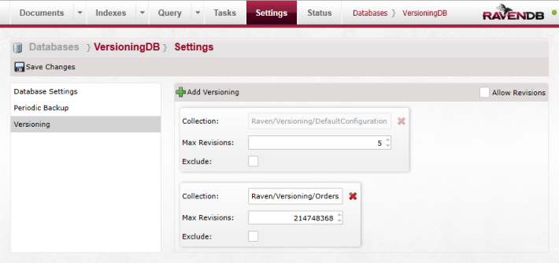

import Admonition from '@theme/Admonition';
import Tabs from '@theme/Tabs';
import TabItem from '@theme/TabItem';
import CodeBlock from '@theme/CodeBlock';
import LanguageSwitcher from "@site/src/components/LanguageSwitcher";
import LanguageContent from "@site/src/components/LanguageContent";

# Bundle: Versioning

If you want to use `Versioning Bundle` then you must select it from the bundle list during the database creation:   
  

After pressing "Next" you will get the following page:  
  

<Admonition type="info" title="Info">
On the left side of the `Bundle Setup` dialog you will see a list of all selected bundles that require additional configuration.
</Admonition>

In here you can set the versioning, press the "Add Versioning" do add another versioning settings.  
You will always have the default versioning here, with it you can edit the default "Max Revisions" number and choose to exclude it.  

When you add a new versioning an additional box will be added:  
  

When you go to edit the "Collection" box you will get a dropdown with the names of the available collections (this happens only when you already have documents in the database:  
  

Bundle settings can always be adjusted in the database settings view, which you can access from top panel.   
  

<Admonition type="info" title="Info">
You can read more information about the Versioning Bundle [here](../../server/extending/bundles/versioning.mdx)
</Admonition>
