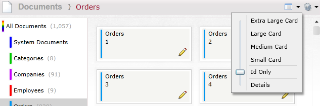
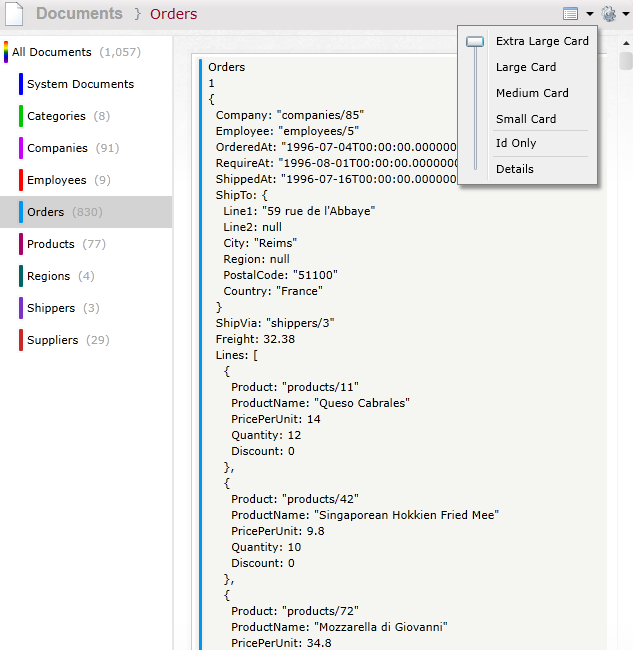
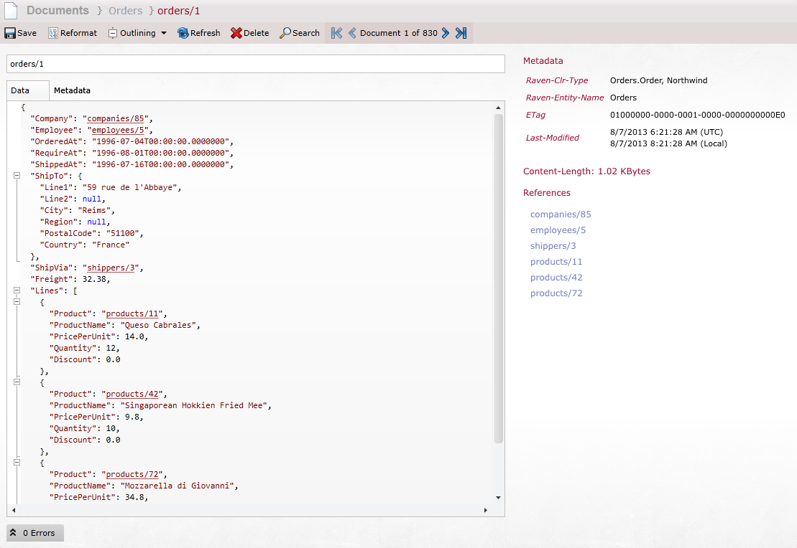
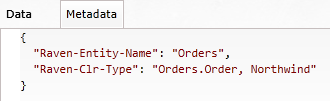
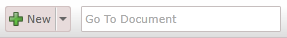
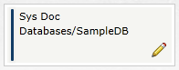
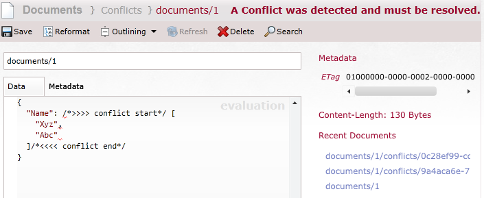

import Admonition from '@theme/Admonition';
import Tabs from '@theme/Tabs';
import TabItem from '@theme/TabItem';
import CodeBlock from '@theme/CodeBlock';
import LanguageSwitcher from "@site/src/components/LanguageSwitcher";
import LanguageContent from "@site/src/components/LanguageContent";

# Documents

This screen gives an overview of all documents in the RavenDB server instance.

## Document collections

When you will enter thin screen, on the left side you will see all available collections for the current database. Each collection will be represented by a different color and a number of documents that belong to it.

<Admonition type="info" title="Info">
A **Collection** in RavenDB is a group of documents sharing the same entity name. It is not a "database table", but rather a logical way of thinking of document groups.
</Admonition>

### Deleting collections

From this screen you can delete a bulk of documents based on their collection association.

Since a Collection is just a logical unit in RavenDB, there is no actual meaning in deleting a collection. By deleting a collection in this screen, you are telling RavenDB to delete _all documents_ sharing the same entity name which is equal to the name of the Collection you are asking to delete.

To perform this delete operation, right click on a Collection name from the list on the left and select "Delete Collection". A confirmation dialog will appear.

<Admonition type="warning" title="Warning">
This operation cannot be undone, and is likely to delete a lot of documents. Use this option wisely.
</Admonition>

## Documents listing

The documents are loaded from the database, newest first, documents from different collections are striped with different colors, in the default view you will get the "Details" view :

In the right side of the view you will find a couple of buttons.

The left button allows you to Export to CSV.

The right button allows you to change the size of the document preview in the listing - from Details view to Extra Large Card view that will show the data of the document as a JSON string (by clicking on the icon toggles between the different views):

  

  

  

    

<Admonition type="info" title="Info">
**Id Only** option is recommended when using a remote server as it uses less bandwidth.
</Admonition>

## Editing a document
By double clicking on a document in the list, or clicking on the pencil icon on it, you get to the document editing screen.

The document ID

 - a unique key assigned to each document - is shown at the top of the form, and below that the document in its JSON representation is ready to be edited:

RavenDB saves additional data on each document, such as it's Collection association (`Raven-Entity-Name`), and all that info can be viewed and edited through the metadata tab:

On the top right corner of this screen you will find several buttons:

- Save
- Reformat: will remove empty line and fix indentation
- Outlining: Select whether to enable, disable or auto collapse outlining
- Refresh: will reload the document from the server
- Delete Document: to permanently delete the current document, will prompt before doing the delete
- Search
- Paging between the neighboring documents

To the right of the form some statistics are shown - the metadata of the current document, formatted, and a list of possible reference found in it. Clicking on a reference will open that document for editing, if it exists in your database.

## Other options

Back in the main listing screen, at the top right corner of the screen you will find 2 additional Options:  

Click on the "Go To Document" and start typing the id of the document you want to edit and suggestions for your in will appear:

If no document exists in the database for the ID you provide you will be redirected to the Documents tab, otherwise the Document edit page will load with the requested document.

Clicking the "New" button will open the document editing screen, but this time with empty fields. After providing a unique ID for the document and filling some data for it, clicking on Save will create it on the server.

If you click on the arrow by the "New" button you will have several options where you will go to the respective pages for each item you want to create:

For a new document created through the Studio the `Raven-entity-Name` metadata attribute which sets its collection is set by the text before the '/' in the provided ID (with first letter in capital), so the a document with ID "albums/626" will be assigned to the "Albums" collection.

If you have a a multi-tenant database set up, while browsing the documents in the Default Database tenant you will see one or more special documents titled "Sys Doc" with the names of the available tenants. Do not edit or delete this document - doing so might cause you to lose access to that tenant, although the actual data in it is not deleted.

## Conflicted documents

The studio provides an easy acccess to replication conflicted documents. In order to get them go to &lt;em&gt;Documents &gt; Conflicts&lt;/em&gt;:

After selecting this option you will see the list of all conflicts:

Each record includes an identifier of a conflicted document, the time when a conflict was detected and a list of conflicted versions. You can select one of them to see the specific version of the conflicted item:

If you double click a list record from _Conflicts_ screen then you will get the document where conflicted parts will be marked as visible on the image below:

Here you can resolve the conflict by manually selecting the appropriate parts of the document and saving it.
