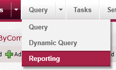
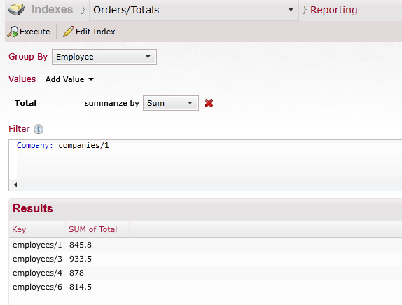

import Admonition from '@theme/Admonition';
import Tabs from '@theme/Tabs';
import TabItem from '@theme/TabItem';
import CodeBlock from '@theme/CodeBlock';
import LanguageSwitcher from "@site/src/components/LanguageSwitcher";
import LanguageContent from "@site/src/components/LanguageContent";

#Dynamic reporting

In order to explain this feature, let us start with an example. First we are creating the a simple index. The one thing to notice is that we are explicitly setting the _Sort_ 
mode for _Total_ to be `Double`. 


Now we are going to &lt;em&gt;Query &gt; Reporting&lt;/em&gt;:



And then we can start issue reporting queries:



This is the equivalent of doing:

```csharp 
select EmployeeID, sum(tot.Total) Total from Orders o join 
    (
        select sum((Quantity * UnitPrice) * (1- Discount)) Total, OrderId from [Order Details]
        group by OrderID
    ) tot
    on o.OrderID = tot.OrderID
where o.CustomerID = @CustomerId
group by EmployeeID
```

The nice thing about this, and what makes this feature different from standard map/reduce, is that you can filter the input data into the aggregation.
In code, this would look something like this:

<TabItem value="query" label="query">
<CodeBlock language="csharp">
{`session.Query<Order>("Orders/Total")
  .Where(x => x.Company == "companies/1")
  .AggregateBy(x => x.Employee)
  .SumOn(x => x.Total)
  .ToList();
`}
</CodeBlock>
</TabItem>

This reporting availability takes advantage of the [dynamic aggregation](../client-api/querying/dynamic-aggregation.mdx) feature.