import Admonition from '@theme/Admonition';
import Tabs from '@theme/Tabs';
import TabItem from '@theme/TabItem';
import CodeBlock from '@theme/CodeBlock';
import LanguageSwitcher from "@site/src/components/LanguageSwitcher";
import LanguageContent from "@site/src/components/LanguageContent";

# Indexes

On the top right you have two options:  

When you choose to create a new index the following page will load:  
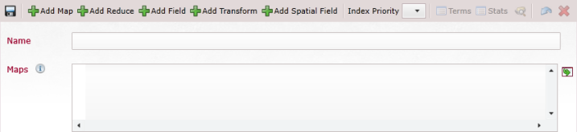  

When you choose Dynamic Query the following page will load:  
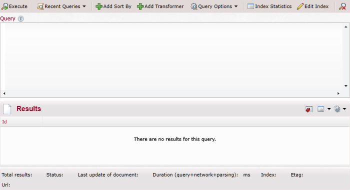 

In Recent Queries you can see and load again recent queries  
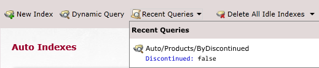 

With "Delete All Idle Indexes" all idle indexes will be deleted. There are also other options available:

 

<Admonition type="note" title="">
`Raven/DocumentsByEntityName` index will never be deleted (it is used by the Studio).
</Admonition>

In the body of the page you can see a list of the available indexes  
If you click on the index name a query page will load with ability to query the result of the index  
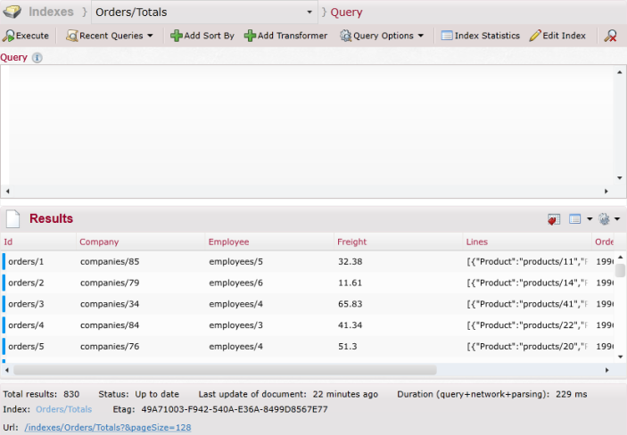 

If you click on the pencil icon of an index the edit index page will load  
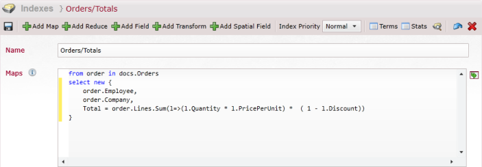  

## Creating new and editing index

In both pages the layout is the same  
On the top right you have several buttons  

  

From right to left:  
- **Save**: will save the changes to the index   
    
- **Add Map**: adds map section to the index  
If you have more the one map you can delete extra maps with the X on the right   
   
   
- **Add Reduce**: adds reduce section to the index  
Only one reduce is possible, if you add a reduce the icon from the top will be removed, if the reduce section is deleted (by pressing the X on the right) it will return to the options  
    
   
- **Add Field**: adds a field section to the index   
It is possible to add as many fields as you want (you can remove a field by pressing the X)    
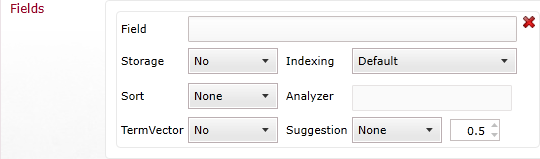   
   
- **Add Transform**: adds transform section to the index  
Only one transform is possible, if you add a transform the icon from the top will be removed, if the transform section is deleted (by pressing the X on the right) it will return to the options  
   
   
- **Add Spatial Field**: adds a spatial field section to the index   
It is possible to add as many apatial fields as you want (you can remove a field by pressing the X)    
    
   
- **Index Priority**: you can choose what priority will current index have.         
- **Terms**: Directs to the page where you can see the list of terms  
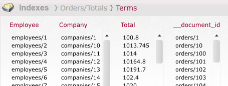    
   
- **Stats**: Directs to the Index statistics  
    
- **Query**: Will send to the query page on the index 
- **Undo**: Will discard all changes made to the index
- **Delete**: Will delete the index
   
In the body of the page you have a place for the title of the index and a body for the map.  
Each index must have both a name and a map.  
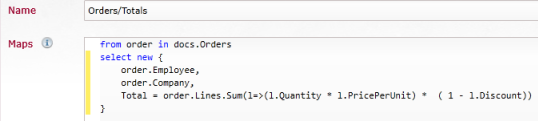

## Querying index

In `Dynamic Query`, at the top of the page, user can choose a collection (or all documents) for which the query will be executed.   

Other then that the layout for dynamic query and index query is the same  
At the top right you have several buttons:  
  

- **Execute**: Runs the query.
- **Recent Queries**: Shows and allows to go to recent queries
- **Add Sort By**: Add option to sort the results:  
  

- **Add Transformer**: Adds a possibility to use a [Transformer](../client-api/querying/results-transformation/result-transformers.mdx) on the results:  
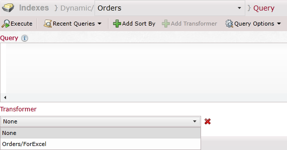  

- **Query Options**: In here you can select if the default operator is OR/AND (default is OR), and if to show fields and index entries.  
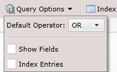  

At the top of the body you have a space to type your query (with [lucene syntax](https://www.codeproject.com/Articles/29755/Introducing-Lucene-Net))  
At to bottom the results of the query  
 

In the area for the query you can use Ctrl + Space for hints on field names:  
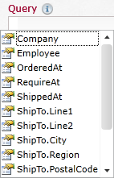 

