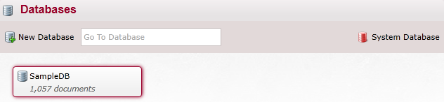
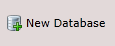
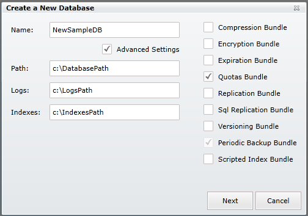
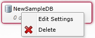
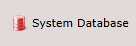
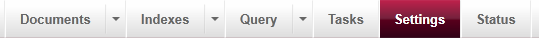
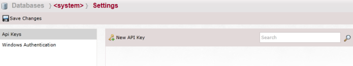
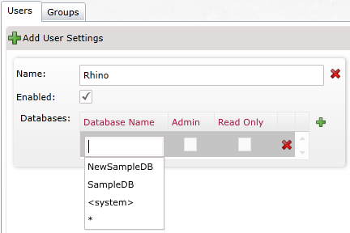

import Admonition from '@theme/Admonition';
import Tabs from '@theme/Tabs';
import TabItem from '@theme/TabItem';
import CodeBlock from '@theme/CodeBlock';
import LanguageSwitcher from "@site/src/components/LanguageSwitcher";
import LanguageContent from "@site/src/components/LanguageContent";

# Multi-Database Support

RavenDB supports multi-tenancy, and the Management Studio provides an easy way to create and manage multiple tenants from the same UI.

At the top right corner of each screen, by the RavenDB logo, we have several indicators:  
  

- **server status indicator** represented by a **dot** on the right side (green - online, red - offline).
- **current tenant** represented by a tenant name (e.g. `SampleDB`). Clicking on the tenant name will open a list of other available tenants and selecting an item from that list will switch the context of the Studio to the selected database.   

## Creating a new tenant

When you load the studio, if you don't have any databases on the server (other then the system database) you will get the "Create a new database" window.

When pressing on the link named "Databases" on the right of each page a new page will load:

On the top left you can create a new database:  

After selecting this option the "Create a new database" window will pop up:  

In this page you need to select a unique name for your database.  
On the right we can select which bundles you want to enable for your database (some bundles require a license to use).  
You can't change the selection of the Periodic Backup Bundle, it is selected according to your license.

Below the name you can check the **advanced settings** option which allows you to set the path for the database, logs and indexes:  
  

Some of the bundles have settings needed to be set on database creation, if one or more of these bundles was selected after you press "Next" you will be promoted to those settings  
  
For details of the bundles settings look in the [bundles section in the studio documentations](bundles)

After the database is created you will have the new database in the databases page, the new database will automatically be selected as the current database. (Note that the database may already contain documents depending on the bundles selected):  
  

Once you have more the one database you can switch between them from any page by clicking on the name of the active database and a list of possible databases will open, click on the database you want to view next:  
  

## Deleting a database

In order to delete a database you need to right-click on it and select "Delete" (you can also press the key "Delete"):  
  

After that you will be promoted with the following window:  
  
In here you can Export the database before deleting it.  
If you choose to physically delete all database data the folder(s) containing the database and all its related info (logs and indexes) will be deleted from your computer, otherwise the files will remain but you will not be able to access them from the server.

## Accessing the System Database

On the right of the database page you have the System Database button:  
  
With this button you can access the system database (this is not advised!)  
After pressing the button you will get this warning page:  
  
After confirmation you will be redirected to the "Documents" tab of the system database.  

## Database Settings

In order to get to the settings page of a database you have 2 options:  
1) Press the **Settings** tab on the main tab panel at the top of the page:    
  
2) In the databases page, right-click on the database you wish to see the settings for and select "Edit settings":  
  

Now you will arrive to the "Settings" page:  
 

Some of the options are available for all databases, and some depend on the selected bundles.  

All databases will have the following:   
1) **Database Settings** - In here you have see the DatabaseDocument that represents the database, you can edit this document, but this is not advised as you can cause damage to the database.   
2) **Periodic Backup** - This section is explained in the [Periodic Backup Page](bundles/periodicbackup)   

Other options are dependent on the bundles selected for this database and are explained in the [bundles section](Bundles).

<Admonition type="info" title="Info">
Do not forget to click on **Save Changes** button on the top-left side before leaving page. Otherwise your changes will be lost.
</Admonition>

## Database Settings for System Database  

Settings for the system database are different from the other databases.  

  

In here you have 2 sections.  

### Api Keys

In here you can set privileged access to databases.  
On the side you have the toolbar for the api keys settings:  
    
- **New API Key** - add a key for a user   
- **Search** - search keys by name   

In order to add a key press the `New API Key` button:  
  

In here you have several details you need to set:  

- **Name** - name of the user
- **Secret** - you cannot select it but you can generate it with the "Generate Secret" button next to it.
- **Full Api Key**, **Connection Strings** and **Direct Link** - those are generated from other parameters of the key with right-click you can copy those to the clipboard
- **Enabled** - check to enable this key.
- **Databases** - in here you set the access for each database
 - **Database Name** - name of the database (will auto complete)
 - **Admin** - Is user considered admin
 - **Read Only** - Is this database a read only for this user

With clicking on the `+` sign you can add another database to the list.  
Pressing on the `X` will remove this setting.  

A filled key will look like this:  
  

### Windows Authentication

In Windows Authentication you can set user access for groups and users:  
   

As you can see you have 2 tabs, one for **Users** and on for **Groups**.  
In each tab you have an option to add another setting (for the respective list).  

Here is what you need to setup:  

- **Name** - the name of the user (as defined by windows) or of the group
- **Enabled** - check to enable this settings.
- **Databases** - in here you set the access for each database
 - **Database Name** - name of the database (will auto complete)
 - **Admin** - Is user/group considered admin
 - **Read Only** - Is this database a read only for this user/group

With clicking on the `+` sign you can add another database to the list.  
Pressing on the `X` will remove this setting.  

A filled setting would look like this:  
  