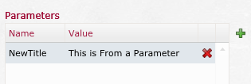
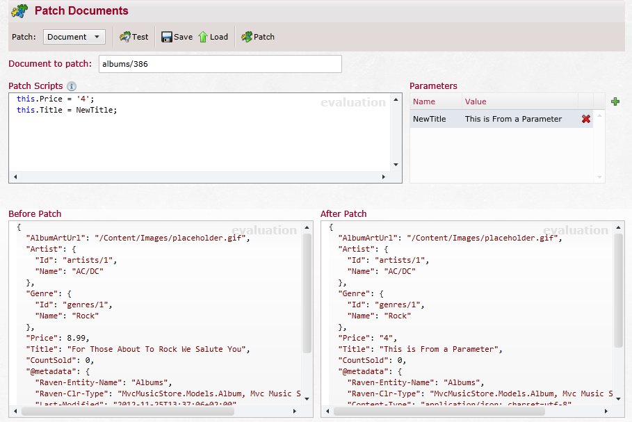
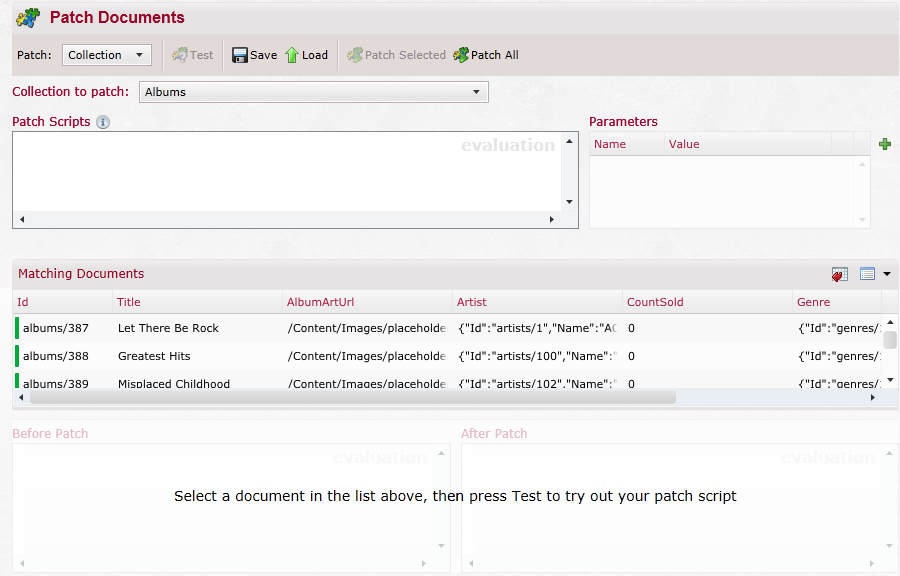
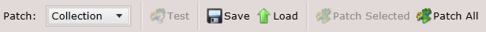

import Admonition from '@theme/Admonition';
import Tabs from '@theme/Tabs';
import TabItem from '@theme/TabItem';
import CodeBlock from '@theme/CodeBlock';
import LanguageSwitcher from "@site/src/components/LanguageSwitcher";
import LanguageContent from "@site/src/components/LanguageContent";

#Patch
With patching you can apply changes to a document or several documents using javascript.

In the studio when you select the "Patch" from the "Documents" dropdown you get this page:
  

In the top left you can select what do you want to patch on (a single document, a collection or an index).  
The page will change according to your selection.  
  

## Patching a Document
When patching a document you will have the following toolbar:  
  
- Patch: in there you can choose what to patch on
- Test: after you select a document to patch you can test it here
- Save: allows you to save this patching settings
- Load: load previous saved patch
- Patch: execute the patch command

Below that you need to select which document you what to patch on:  
  

After you will select a document to patch you will see that the "Before patch" area will show you the selected document:  
  

Now you need to enter the patch script:  
  

In this sample you can see 2 ways to patch:  
- Write in code the value you want
- Use Parameters

You can use "ctrl+space" to get suggestions on the script.  

In order to add parameters press the "+".  
And empty parameter will be added.  
You need to enter both Name and a value.  
If you want to remove a parameter, press the "X" on its right.  
  

Here is a sample on how the page will look filled after we press "Test":  
  
As you can see the "Price" and "Title" in "After patch" were updated according to the script (pay attention that the document was NOT patched yet, this is only the test).  

## Patching a Collection
When selecting the collection option the page will change a bit:  
  

The new toolbar has some differences:  
  

As you can see the Patch option was replaced with 2 options:  

- Patch Selected - will patch only the selected items in the "Matching Documents" section.
- Patch All - will patch all documents in the collection.  

In order to test you need to select a document from the "Matching Documents" to test the patch on.

Under the toolbar you have a dropdown with the list of the available collections in you database:  
  

The other addition here is the "Matching Documents" section:  
  
In here you can select which documents you want to patch (if you don't want to patch all of them), if you want to test the patch you select the document to test from here as well (you can select several documents but the test will still be on a single document).

## Patching an Index
When selecting the index option the page will change a bit:  
  

When patching an index the toolbar is the same as it is for collections.  
Below the toolbar you select which index you want to work on:  
  

Now you can enter a query for this index (the "Matching Documents" will update automatically):  
  