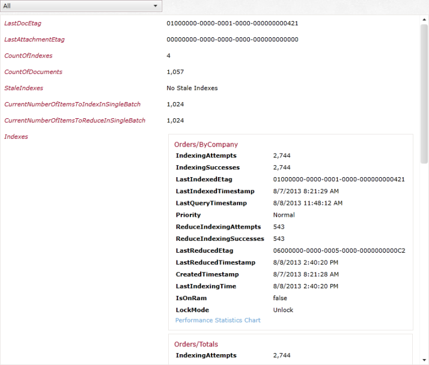

import Admonition from '@theme/Admonition';
import Tabs from '@theme/Tabs';
import TabItem from '@theme/TabItem';
import CodeBlock from '@theme/CodeBlock';
import LanguageSwitcher from "@site/src/components/LanguageSwitcher";
import LanguageContent from "@site/src/components/LanguageContent";

# Statistics

On the bottom of each screen various statistics on the database are shown:  

In here you can see:  

- Number of [documents](../studio/documents.mdx)
- Number of [indexes](../studio/indexes.mdx)
- Number of stale indexes
- Number of errors
- Number of triggers
- Number of tasks waiting to happen

On the statistics page you can see these options:

- Last Document Etag
- Last Attachment Etag
- Count of indexes
- Count of documents
- Batches sizes
- List of stale indexes (if there are any stale indexes)
- for each index you have the following data:
 - Indexing Attempts
 - Indexing Successes
 - Indexing Failures
 - Reducing Attempts
 - Reducing Successes
 - Reducing Failures
 - Last Indexed Etag
 - Last Indexed Time Stamp
 - Last Reduced Etag
 - Last Reduced Time Stamp   
 - Created Time Stamp   
 - Last Indexing Time   
 - Lock Mode
 - Performance Statistics Chart

If you don't see any of the above it means it is 0.

If you click on the index name you will see only the statistics for this index:  

On the top left you can select what do you want to view:  
  

- **All**: shows all the statistics
- **Single Items**: Shows the statistics that are not a list (number of documents, number of indexes, etc.)
- **Indexes**: Show only the Indexes statistics.
- **Index_Name**: for each index you have in the database you will see its name here, This will show only the statistics for this index.