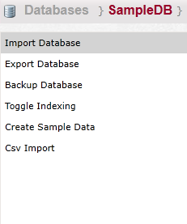
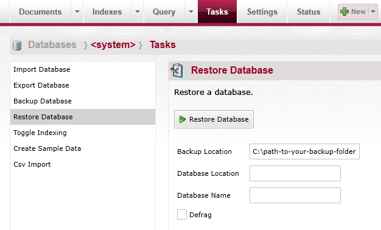

import Admonition from '@theme/Admonition';
import Tabs from '@theme/Tabs';
import TabItem from '@theme/TabItem';
import CodeBlock from '@theme/CodeBlock';
import LanguageSwitcher from "@site/src/components/LanguageSwitcher";
import LanguageContent from "@site/src/components/LanguageContent";

# Tasks

On the tasks page you can import and export your database:  

## Import Database

In here you can import from a .ravendump or .raven.dump file.  
Pay attention that existing documents may be overwritten.  

Imported data will be stored in the current database

## Export Database

With this task you can export the selected database to a .ravendump file.

## Backup database
You need to select a location to store the backup:  

## Toggle Indexing
In here you can enable or disable indexing (mostly for debugging)
You can see the current state of the indexing in here as well:  

## Create sample Data 
You can create a sample data for your database here, this option will only work for an empty database 

## CSV Import
Select a CSV file and import it to this database

## Restore Database (will only appear in the system database) 
In order to restore from a previous backup you need to enter the backup location, an optional location for the database and a name for the database.  Also there is a possibility to force a defragmentation by checking `Defrag` option.
