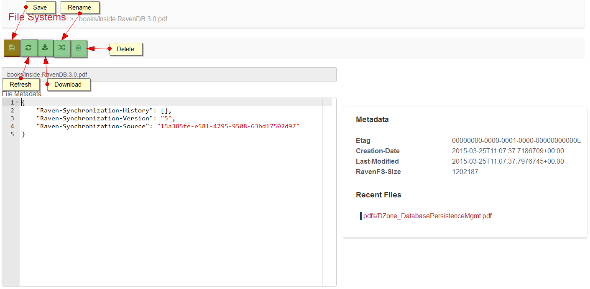
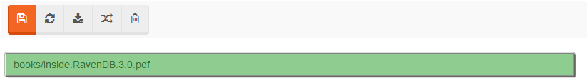

import Admonition from '@theme/Admonition';
import Tabs from '@theme/Tabs';
import TabItem from '@theme/TabItem';
import CodeBlock from '@theme/CodeBlock';
import LanguageSwitcher from "@site/src/components/LanguageSwitcher";
import LanguageContent from "@site/src/components/LanguageContent";

#File edit view

The file edit page allows you to view and edit file metadata and provides access to download a file's content. You can also change a file name here or 
delete the file completely. The page looks as follow:

  
    
## Action bar

Action bar contains the following buttons:

* `Save` - saves file metadata on a server (enabled when changes are detected),
* `Refresh` - loads file metadata from a server,
* `Download` - initializes download operation of file content to a local machine,
* `Rename` - allows to change a file name,
* `Delete` - deletes file from a server.

## File name

The name of the file in RavenFS is always the full path. The field isn't editable, use `Rename` button to change the file name.

  

## File rename

Provide a new file name in the new dialog window to rename a file. Note that you can *move* the file between folders because the entire full path can
be changed:

  

## Metadata

There are two metadata components on the page. The first one contains editable metadata records that are formatted as JSON and available to modify.
You can change it and click `Save` button to reflect that change on the server.

The second section is non editable and it contains RavenFS specific information about the file like `Last-Modified` or `Etag` records. Additionally this
panel also includes links to recently viewed files.
