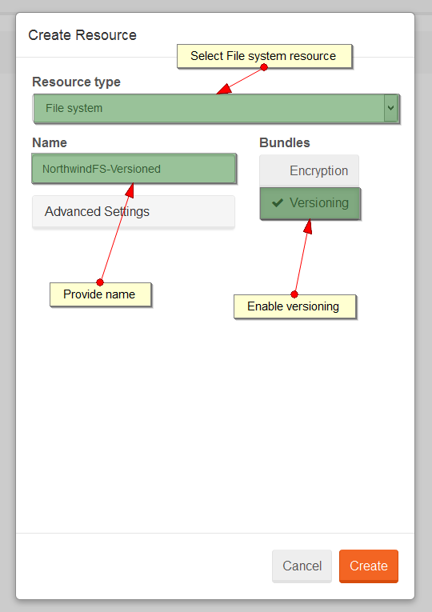
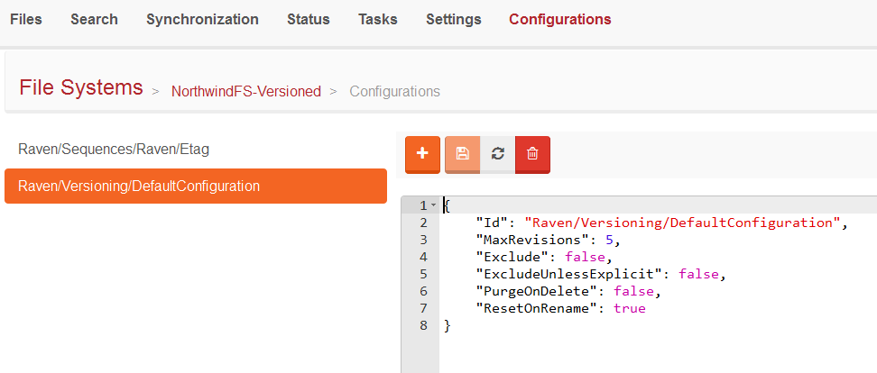
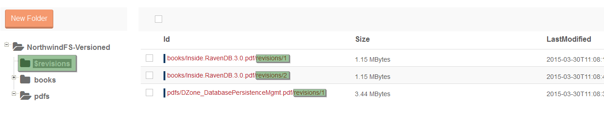

import Admonition from '@theme/Admonition';
import Tabs from '@theme/Tabs';
import TabItem from '@theme/TabItem';
import CodeBlock from '@theme/CodeBlock';
import LanguageSwitcher from "@site/src/components/LanguageSwitcher";
import LanguageContent from "@site/src/components/LanguageContent";

#How to enable and setup versioning?

To take advantage of [Versioning bundle](../../server/bundles/versioning.mdx) you have to activate it when a file system is created.
Take the following steps to setup the versioning:

Step 1. Create a file system with `Versioning` enabled:

  

Step 2. Next you will get the dialog that specifies options for a default configuration:

  

You can see that this configuration is stored as `Raven/Versioning/DefaultConfiguration` config:

  

Step 3. If you want to overwrite the default configuration for a selected directory, create the appropriate configuration and
save it as `Raven/Versioning/[directory/path]` config item. For example to create the versioning config for `/temp` directory
and disable the versioning there, create the config as follow:

  

  

## Revisions folder

All file revisions are visible under special `$revisions` directory:

