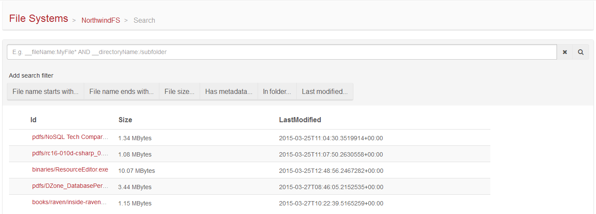
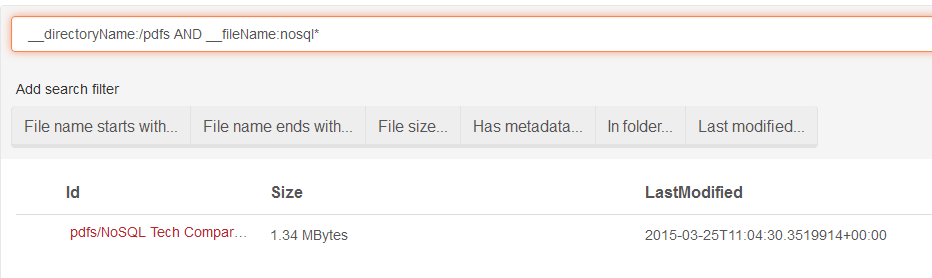

import Admonition from '@theme/Admonition';
import Tabs from '@theme/Tabs';
import TabItem from '@theme/TabItem';
import CodeBlock from '@theme/CodeBlock';
import LanguageSwitcher from "@site/src/components/LanguageSwitcher";
import LanguageContent from "@site/src/components/LanguageContent";

#Search view

This view allows running queries according to Lucene syntax and browse files that match specified criteria.

  

## Built-in filters

The text box is used to define filtering criteria. The criteria has to be a valid Lucene query. You can search by 
user defined metadata or built-in one set by RavenFS. To get full list of default metadata records read [indexing](../indexing.mdx) article.

The studio has a few, built-in filters in order to help you to create the query that contains common conditions:

  

## Example

Lets find all files in `pdfs` directory which names start with `nosql`:

  

