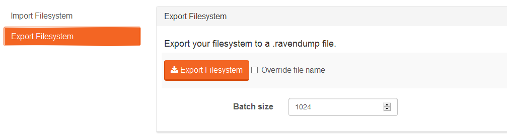

import Admonition from '@theme/Admonition';
import Tabs from '@theme/Tabs';
import TabItem from '@theme/TabItem';
import CodeBlock from '@theme/CodeBlock';
import LanguageSwitcher from "@site/src/components/LanguageSwitcher";
import LanguageContent from "@site/src/components/LanguageContent";

#Export and import file system

Export and Import tabs enable fast data moving between file systems.

## Export

  

The easiest way to export a file system is by clicking the `Export Filesystem` button. Dialog for saving file will appear and you can save the export file.

By default the name of the export file is `Dump of [FILE_SYSTEM_NAME], [YYYY-MM-DD HH-MM].ravendump`, you can change it by selecting `Override file name`.

## Import

  

The import follows the same procedure as the export. You can click `Choose file` button to choose a file you want and the import will start automatically. Note that this operation will overwrite existing files.
