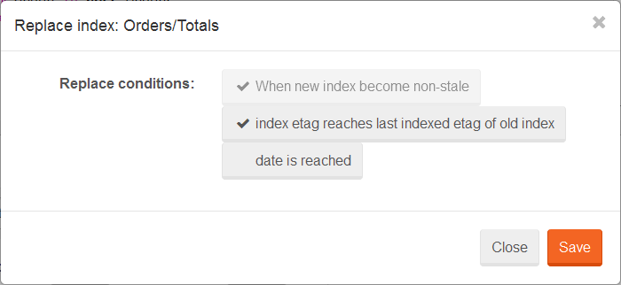

import Admonition from '@theme/Admonition';
import Tabs from '@theme/Tabs';
import TabItem from '@theme/TabItem';
import CodeBlock from '@theme/CodeBlock';
import LanguageSwitcher from "@site/src/components/LanguageSwitcher";
import LanguageContent from "@site/src/components/LanguageContent";

# Side-by-Side indexes

This feature enables you to create an index that will be replaced by another one after one of the following conditions are met:

- new index becomes non-stale (non-optional)
- new index reaches last indexed etag (in the moment of creation of a new side-by-side index) of a index that will be replaced (optional)
- particular date is reached (optional)

## Applications

As you probably know, making any changes in index definition will reset its indexing state and indexing process will start from scratch. This situation can be troublesome when you need to update index (assuming that changes are backward compatibile) on production server without having your application display partial results (due to index reset). This is why side-by-side indexes were introduced.

## Deployment

### using AbstractIndexCreationTask

<TabItem value="side_by_side_1" label="side_by_side_1">
<CodeBlock language="csharp">
{`void SideBySideExecute(
	IDatabaseCommands databaseCommands,
	DocumentConvention documentConvention,
	Etag minimumEtagBeforeReplace = null,
	DateTime? replaceTimeUtc = null);

Task SideBySideExecuteAsync(
	IAsyncDatabaseCommands asyncDatabaseCommands,
	DocumentConvention documentConvention,
	Etag minimumEtagBeforeReplace = null,
	DateTime? replaceTimeUtc = null,
	CancellationToken token = default(CancellationToken));

void SideBySideExecute(
	IDocumentStore store,
	Etag minimumEtagBeforeReplace = null,
	DateTime? replaceTimeUtc = null);

Task SideBySideExecuteAsync(
	IDocumentStore store,
	Etag minimumEtagBeforeReplace = null,
	DateTime? replaceTimeUtc = null);
`}
</CodeBlock>
</TabItem>

#### Example

<TabItem value="side_by_side_4" label="side_by_side_4">
<CodeBlock language="csharp">
{`// This method will create 'ReplacementOf/Orders/ByCompany' index, which will replace 'Orders/ByCompany' when
// - new index will become non-stale
// - new index will reach at least '01000000-0000-000E-0000-000000000293' etag
// - in 6 hours from the deployment date
new Orders_ByCompany().SideBySideExecute(store.DatabaseCommands, store.Conventions, Etag.Parse("01000000-0000-000E-0000-000000000293"), DateTime.UtcNow.AddHours(6));
`}
</CodeBlock>
</TabItem>

### using DocumentStore

<TabItem value="side_by_side_2" label="side_by_side_2">
<CodeBlock language="csharp">
{`void SideBySideExecuteIndex(
	AbstractIndexCreationTask indexCreationTask,
	Etag minimumEtagBeforeReplace = null,
	DateTime? replaceTimeUtc = null);

Task SideBySideExecuteIndexAsync(
	AbstractIndexCreationTask indexCreationTask,
	Etag minimumEtagBeforeReplace = null,
	DateTime? replaceTimeUtc = null);

void SideBySideExecuteIndexes(
	List<AbstractIndexCreationTask> indexCreationTasks, 
	Etag minimumEtagBeforeReplace = null, 
	DateTime? replaceTimeUtc = null);

Task SideBySideExecuteIndexesAsync(
	List<AbstractIndexCreationTask> indexCreationTasks, 
	Etag minimumEtagBeforeReplace = null, 
	DateTime? replaceTimeUtc = null);
`}
</CodeBlock>
</TabItem>

<Admonition type="info" title="Execution of multiple side by side indexes" id="execution-of-multiple-side-by-side-indexes" href="#execution-of-multiple-side-by-side-indexes">
Side by side indexes are created as a single request when overloads for multiple indexes are used.
</Admonition>

#### Example

<TabItem value="side_by_side_3" label="side_by_side_3">
<CodeBlock language="csharp">
{`using (var store = new DocumentStore
	                   \{
		                   Url = "http://localhost:8080/",
						   DefaultDatabase = "Northwind"
	                   \})
\{
	store.Initialize();

	// This method will create 'ReplacementOf/Orders/ByCompany' index, which will replace 'Orders/ByCompany' when
	// - new index will become non-stale
	// - new index will reach at least '01000000-0000-000E-0000-000000000293' etag
	// - in 6 hours from the deployment date
	store.SideBySideExecuteIndex(new Orders_ByCompany(), Etag.Parse("01000000-0000-000E-0000-000000000293"), DateTime.UtcNow.AddHours(6));
\}
`}
</CodeBlock>
</TabItem>

### Studio

- first you need to [edit](../studio/overview/indexes/index-edit-view.mdx) index. In our example we are picking `Orders/Totals` and we are adding `ShipVia` field.

- finally, when index definiton is ready, you need to save index as `Side-by-Side` using action bar. The popup will appear with the name of an index that will be replaced and a list of replacement conditions.

