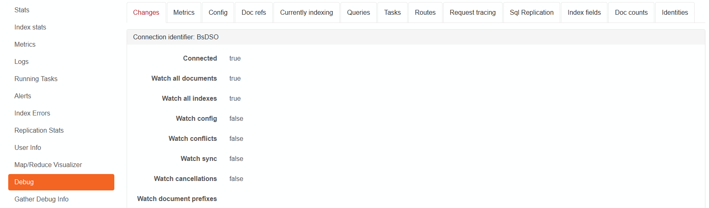

import Admonition from '@theme/Admonition';
import Tabs from '@theme/Tabs';
import TabItem from '@theme/TabItem';
import CodeBlock from '@theme/CodeBlock';
import LanguageSwitcher from "@site/src/components/LanguageSwitcher";
import LanguageContent from "@site/src/components/LanguageContent";

# Troubleshooting: Debug endpoints

<Admonition type="info" title="">
All endpoints that are **not `<system>`-only** can be accessed for particular database by adding `/databases/{database_name}/` prefix.
</Admonition>

## Overview

| Endpoint | Method | Parameters | Description | `<system>`-only |
| ----- |:-----:|:-----| ----- |:-----:|
| debug/prefetch-status | GET | | Return prefetching statuses for all indexing groups. | |
| debug/format-index | POST | - _(Content)_ JSON-array of indexing functions | Simplifies and formats given indexing functions. | |
| `debug/indexing-perf-stats?format={format}` | GET | - _format_ - output format: `json` or `csv` (if empty: json) | Indexing performance statistics like duration and input/output count. | |
| debug/indexing-batch-stats | GET |  | Indexing performance stats shown for indexing batches | |
| debug/reducing-batch-stats | GET |  | Indexing performance stats shown for reducing batches | |
| debug/plugins | GET | | Returns active plugins e.g. triggers and startup tasks. | |
| debug/changes | GET | | Returns Changes API connection details e.g. connection identifier or subscription details. | |
| debug/sql-replication-stats | GET | | Various metrics with SQL Replication performance. | |
| debug/metrics | GET | | All database metrics. | |
| debug/config | GET | | Database configuration file. | |
| `debug/docrefs?id={id}&op={op}` | GET | - _id_ - id of a document to check&lt;br /&gt;- _op_ - operation type: `from` or `to` | Returns count of references and array of referenced document keys. | |
| debug/index-fields | POST | - _(Content)_ - indexing function | Returns array of field names extracted from indexing function. | |
| `debug/list?id={id}&key={key}` | GET | - _id_ - list name&lt;br /&gt;- _key_ - value | Returns value found under _key_ from list. | |
| `debug/list-all?id={id} `| GET | - _id_ - list name | Returns all values for given list. | |
| debug/queries | GET | | Returns list of currently running queries. | |
| debug/suggest-index-merge | GET | | Returns index merge suggestions. | |
| debug/sl0w-d0c-c0unts | GET | | Counts the number and size of documents for each collection. CAUTION: resource intensive and slow. | |
| debug/user-info | GET | | Returns information about current authenticated user. | |
| debug/tasks | GET | | Returns list of all current database tasks. | |
| debug/routes | GET | | Returns list of all available endpoints. | Y |
| debug/currently-indexing | GET | | Returns current indexing operations details (e.g. what indexes are working and what is the current indexing rate) | |
| debug/remaining-reductions | GET | | Returns information about remaining, scheduled reductions. | |
| debug/request-tracing | GET | | Returns the list of recent requests with detailed info (e.g. headers, execution type). | |
| `debug/identities?start={start}&pageSize={pageSize}` | GET | - paging parameters | Returns next identity values for collection types, indexes, transformers, etc. | |
| debug/info-package | GET | | Creates debug info package that contains detailed information about the database (e.g. replication information, statistics, queries, requests, hardware information, etc.) | |
| debug/transactions | GET | | Returns information about current DTC transactions. | |
| `debug/raw-doc?id={id}` | GET | - _id_ - if of a document | Returns raw document data. | |
| debug/subscriptions | GET | | Returns information about existing data subscriptions. |
| | | | |
| `/admin/voron/tree/{name}` | GET | - _name_ - a tree name | Returns the state of a Voron tree. |
| admin/stats | GET | | Returns server-wide statistics (e.g. server name, uptime, memory statistics, loaded databases information). More [here](../../server/administration/statistics.mdx). | |
| admin/gc | GET | | Starts the garbage collection process. | |
| admin/loh-compaction | GET | | Starts the garbage collection with LOH compaction process. | |
| admin/debug/info-package | GET | - _(Optional)_ stacktrace - indicates if stacktraces should be included in package (may freeze server for some time to gather them). | Returns debug info package for all loaded databases. |
| admin/detailed-storage-breakdown | GET | | Returns storage report (e.g. number of documents, indexes, attachments and other storage-dependant statistics). | |
| admin/low-memory-notification | POST | | Simulates low memory on server and executes all memory conservation events. | |
| admin/generate-oauth-certificate | GET | | Generates OAuth certificate. | |
| | | | |
| build/version | GET | | Returns product and build version. | Y |
| | | | |
| `indexes/{index_name} ?op=forceWriteToDisk` | POST | - _index_name_ - index name | Force in-memory auto-index persistence. | |
| | | | |
| `replication/explain/{*docId}?destinationUrl={destinationUrl}&databaseName={databaseName}` | GET | - _docId_ - Id of a document to check&lt;br /&gt;- _destinationUrl_ - destination server URL&lt;br /&gt;- _databaseName_ - destination database name | Tries to explain what is the replication status for a given document on a given replication destination e.g. if the document should have been already replicated or will be replicated | |

## Studio

Most of the endpoints can be accessed from the Studio by accessing the `Debug` section in  the `Status` tab.

