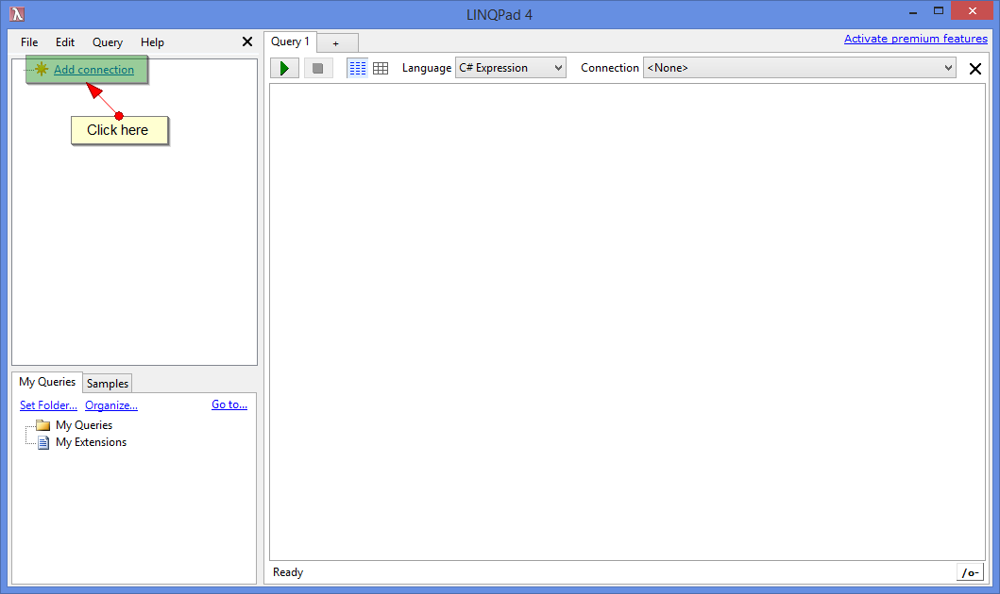
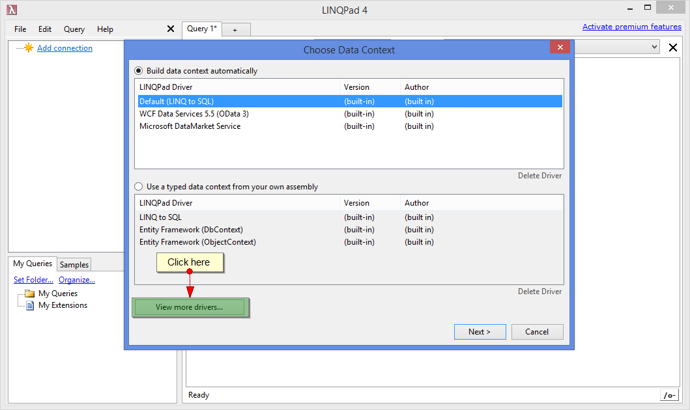
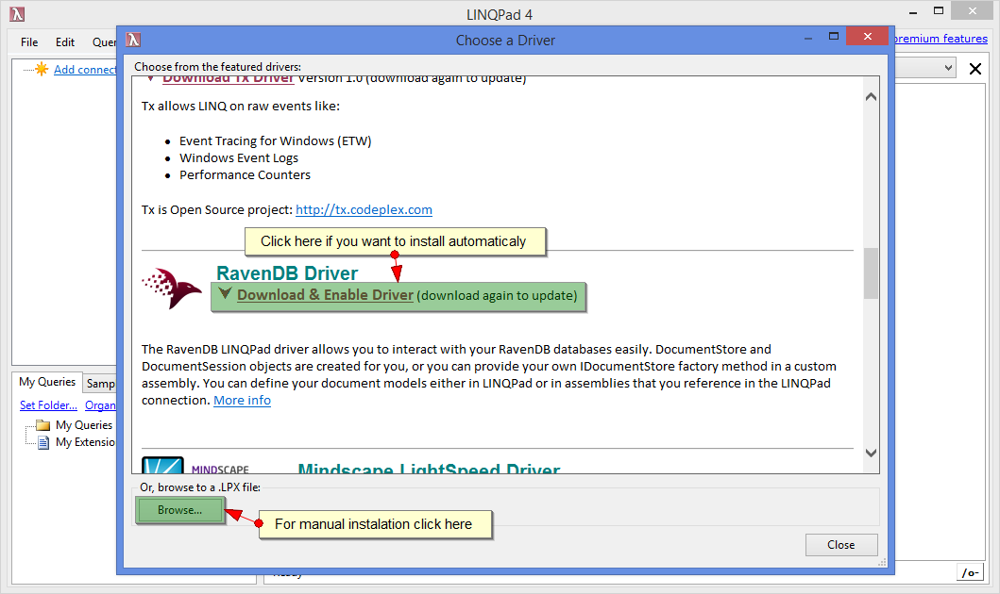
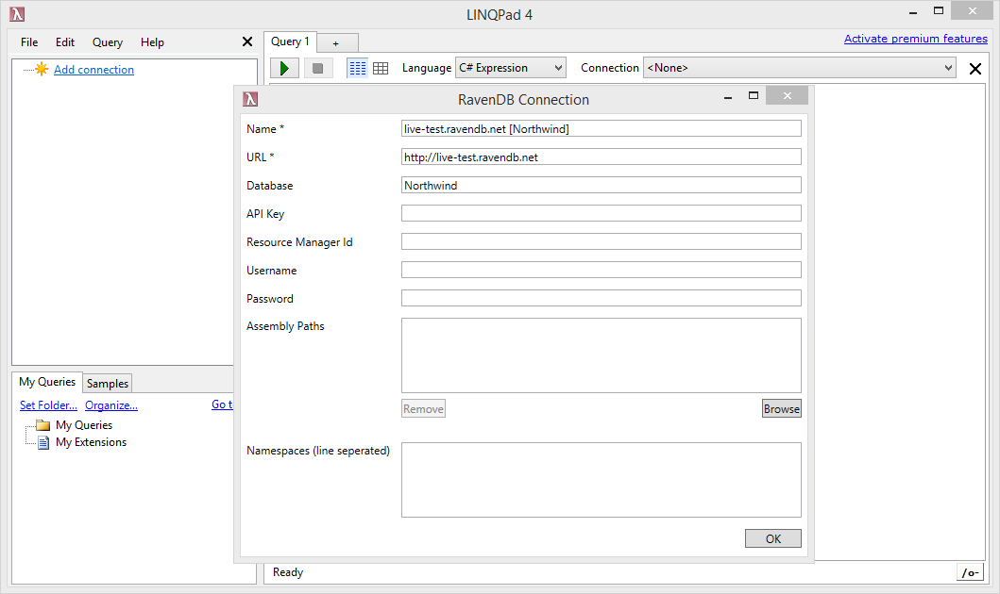

import Admonition from '@theme/Admonition';
import Tabs from '@theme/Tabs';
import TabItem from '@theme/TabItem';
import CodeBlock from '@theme/CodeBlock';
import LanguageSwitcher from "@site/src/components/LanguageSwitcher";
import LanguageContent from "@site/src/components/LanguageContent";

# Getting started: Playground Server

Live-test server offers a full functionality of a RavenDB server and is available at [live-test.ravendb.net](http://live-test.ravendb.net/). We encourage you to check it out and test various functionalities.

<Admonition type="info" title="Information" id="information" href="#information">

- server accepts remote connectivity, so you can build your applications locally for testing purposes and specify its address - `http://live-test.ravendb.net/` (more [here](../client-api/creating-document-store.mdx))
- sample database can be deployed as in any normal instance (more [here](../studio/overview/tasks/create-sample-data.mdx))

</Admonition>

<Admonition type="warning" title="Important" id="important" href="#important">

- all databases available at `live-test.ravendb.net` server are publicly available and can be accessed, managed and copied by any user.
- periodicaly all databases will be removed

</Admonition>

## LINQPad

Driver for [LINQPad](https://www.linqpad.net/) that supports RavenDB connectivity was created by Ronnie Overby. It can be downloaded from project [GitHub page](https://github.com/ronnieoverby/RavenDB-Linqpad-Driver) (compiling the solution will overwrite the installed driver) or installed directly through LINQPad.

### Installation

Step 1. Click on `Add Connection` in LINQPad.

  

Step 2. In `Choose Data Context` view click on `View more drivers...`.

  

Step 3. In `Choose a Driver` view find a RavenDB driver on a list of drivers and install it or if you are interested in manual installation, click on `Browse` at the bottom of the page and specify `.lpx` file with the driver.

  

### Connecting

Step 1. Select `RavenDB Driver` from `Choose Data Context` view.

  

Step 2. `RavenDB Connection` view will appear where you can specify all needed information and credentials that will allow you to connect to a database (e.g. you can specify `http://live-test.ravendb.net/`)

  

### Querying

Please visting project [GitHub page](https://github.com/ronnieoverby/RavenDB-Linqpad-Driver) for more information on how to query or watch [this](https://www.youtube.com/watch?v=XgsPvyk0bjM) video created by author of the driver that will guide you through available functionalities.

