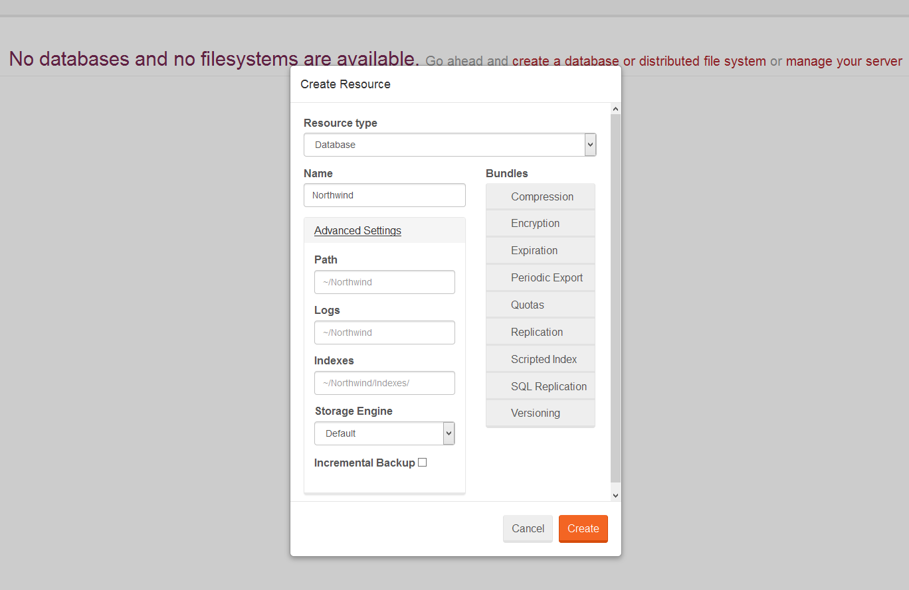
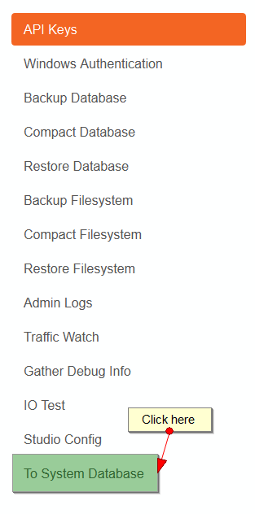
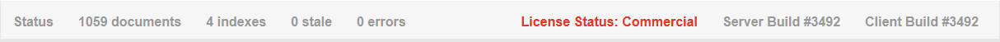
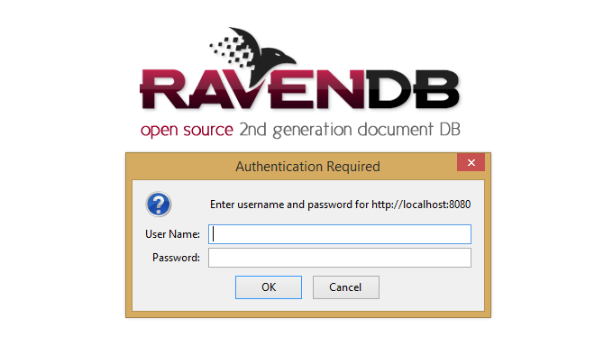

import Admonition from '@theme/Admonition';
import Tabs from '@theme/Tabs';
import TabItem from '@theme/TabItem';
import CodeBlock from '@theme/CodeBlock';
import LanguageSwitcher from "@site/src/components/LanguageSwitcher";
import LanguageContent from "@site/src/components/LanguageContent";

# Accessing Studio

RavenDB comes with a Management Studio (aka Studio) that can be accessed by any modern browser using the server url (e.g. `http://localhost:8080/` when your server runs at 8080 port). The Studio lets you manage data and indexes, issue queries, perform various maintenance actions, and more, all in easier manner.

As said before, the Studio can be accessed on any RavenDB server, regardless of how it is deployed (you need to start the http server when Embedded instance is used). However, it does require the user to authenticate against the server, most commonly using their Windows credentials.

## First run & creating database

When you just deployed your server and there are no databases, the following screen will show up:

  

Here you can create your first database by specifying its name, list of active bundles (optionally) or more advanced settings like [storage engine](../server/configuration/storage-engines.mdx), various paths or support for incremental backups.

---

## Selecting database

If your server contains one or more databases, the database creation windows will not show up. Instead, you will be navigated to a database selection screen, where you can see all your databases (and file systems), disable or even delete them.

  

This view can also be accessed by pressing on `Resources` link from top navigation bar.

---

## Manage Your Server

To access manage your server you need to visit `Databases and  File Systems View` and click on `Manage Your Server` button.

  

---

## Accessing System database

To access `<system>` database please go to `Manage Your Server` section and click on `To System Database` button available in left pane.

 

---

## Navigation

If a database is selected, top navigation bar will be filled with the following menu items that will navigate you to various parts of the Studio:

  

Note the bottom navigation bar containing information about server build number, license, and basic statistics for the selected database.

  

---

## Studio & Authentication

If server requires [authentication](../server/configuration/authentication-and-authorization.mdx), it may ask you to provide valid windows credentials or API Key. If you will just open up Studio without adding anything to the URL (e.g. `http://localhost:8080/`) windows authentication will be assumed and following screen will appear (different browsers might display slightly different dialogs):

  

If you want to authorize yourself using the API Key, you must add `#api-key=<api_key_here>` hash tag e.g. `http://localhost:8080/studio/index.html#api-key=key\ThisIsMySecret` or if you do not want to provide API Key in the URL, you can add `#has-api-key`, so the Studio will open up a dialog where you can enter your key, before any Studio-Server communication:

  

