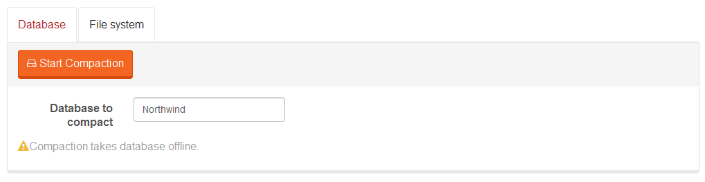

import Admonition from '@theme/Admonition';
import Tabs from '@theme/Tabs';
import TabItem from '@theme/TabItem';
import CodeBlock from '@theme/CodeBlock';
import LanguageSwitcher from "@site/src/components/LanguageSwitcher";
import LanguageContent from "@site/src/components/LanguageContent";

# Manage Your Server: Compact

Here you can easily compact data by choosing an appropriate database or a file system.

<Admonition type="warning" title="Warning" id="warning" href="#warning">

- database will be **offline** during compaction

</Admonition>

