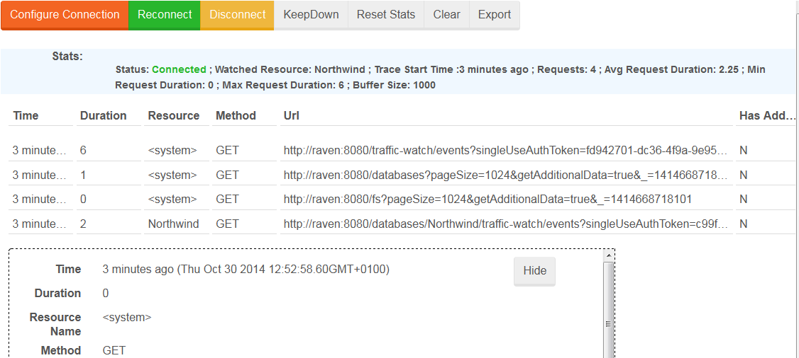

import Admonition from '@theme/Admonition';
import Tabs from '@theme/Tabs';
import TabItem from '@theme/TabItem';
import CodeBlock from '@theme/CodeBlock';
import LanguageSwitcher from "@site/src/components/LanguageSwitcher";
import LanguageContent from "@site/src/components/LanguageContent";

# Manage Your Server: Traffic Watch

Thanks to the Traffic Watch you can easily view all incoming HTTP Requests, and their details, for the chosen database. To establish such a connection, you need to choose from the following options that appear when you click on the `Configure Connection` button:

- log entries buffer size,
- name of the database or filesystem that will be monitored

