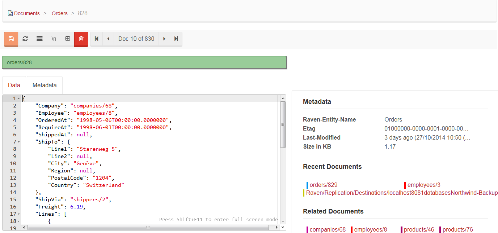
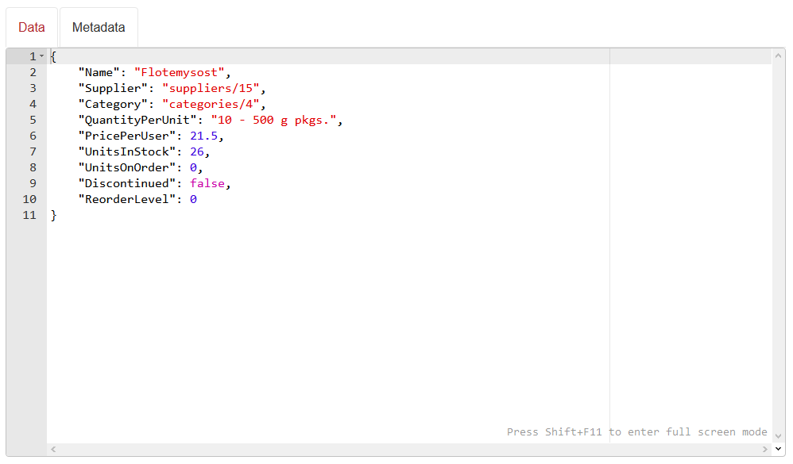
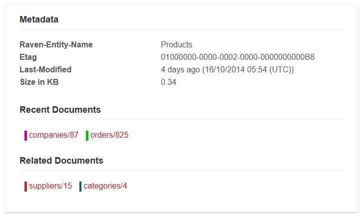

import Admonition from '@theme/Admonition';
import Tabs from '@theme/Tabs';
import TabItem from '@theme/TabItem';
import CodeBlock from '@theme/CodeBlock';
import LanguageSwitcher from "@site/src/components/LanguageSwitcher";
import LanguageContent from "@site/src/components/LanguageContent";

# Documents: Document Edit View

Whenever you want to edit a document (e.g. by clicking on Id in [Documents View](../../../studio/overview/documents/documents-view.mdx)) you will be redirected to `Document Edit View` which allows you to view or edit document's content and its metadata.

## Action Bar

Action Bar contains the following buttons:

- `Save` - saves document on a server (enabled when changes are detected),
- `Refresh` - loads a document from a server,
- `Format` - adjusts JSON formatting,
- `New Line Mode` - toggles new line visibility,
- `Auto-Collapse` - toggles if nested complex properties should be collapsed,
- `Delete` - deletes document from a server,
- `Pager` - pages through documents

  

## Document Key

Under the `Action Bar` there is a textbox with the key under which a document is stored on  a server.

  

<Admonition type="info" title="Key generation" id="key-generation" href="#key-generation">

- If a key prefix is typed alone e.g. `products/`, then during save next available key will be assigned for this prefix.
- If a key is left blank, then during save the document will have a GUID assigned as a key.

</Admonition>

<Admonition type="warning" title="">
Changing document's key to a different one and saving it does not overwrite existing document. It creates a new one (or overwrites a document found under new key).
</Admonition>

## Document Editor

Document data and associated metadata (e.g. collection association - `Raven-Entity-Name`) can be manipulated in the editor by switching to an appropriate tab.

  

  

## Metadata

Metadata section can be found on the right side of the view, next to the editor. You can find all metadata associated with the document, such as document's current etag, date of last modification, and size in KB. If a document contains any related documents, their keys are displayed here, and if it is not the first viewed document, the list of recent ones is available too.

  

