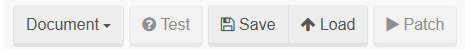
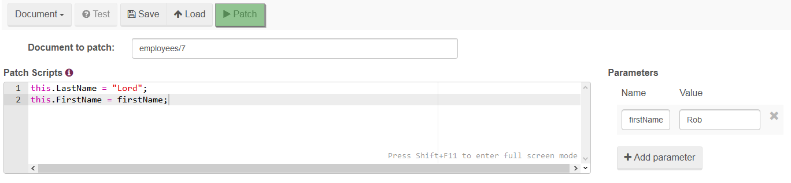
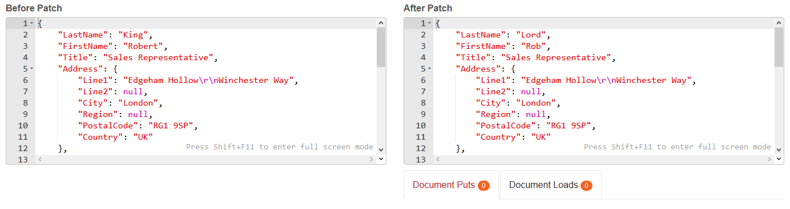

import Admonition from '@theme/Admonition';
import Tabs from '@theme/Tabs';
import TabItem from '@theme/TabItem';
import CodeBlock from '@theme/CodeBlock';
import LanguageSwitcher from "@site/src/components/LanguageSwitcher";
import LanguageContent from "@site/src/components/LanguageContent";

# Documents: Patch View

Single documents, entire collections or query results can be patched using this view. More detailed information of JavaScript patching capabilities can be found [here](../../../client-api/commands/patches/how-to-use-javascript-to-patch-your-documents.mdx). This article focuses on the Studio's side of the patching.

## Action Bar

Action bar contains the following buttons:

- `Patch type selector` (single document, collection, or index),
- `Test` - you can test your patch here, without modifying actual data,
- `Save` - patch script can be saved to use this action later,
- `Load` - saved patch scripts can be loaded using this action,
- `Patch` - execute patch on actual data

  

## Patch Scripts

After specifying patch type, we need to do **one** of the following:

- select a document to patch by typing its key,
- select a collection that we want to patch,
- select an index and type a query that we want to use for patching

After doing that, we need to type our script (examples of scripts can be found [here](../../../client-api/commands/patches/how-to-use-javascript-to-patch-your-documents.mdx)) with parameters (if needed) and click on `Patch` button to apply it.

  

## Testing Patch

If you want to test your patch before applying it to real data, you can test it by pressing the `Test` button. This will fill up `After Patch` section with patched data and list what documents were put (`PutDocument`) or loaded (`LoadDocument`) using your script.

  

## Saving Patches

Each patch can be saved using the `Save` action from `Action Bar` for further use (you need to type its name). To load it just press the `Load` button from the `Action Bar` and select desired patch.

