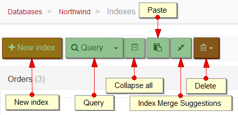
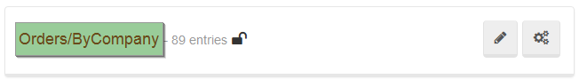
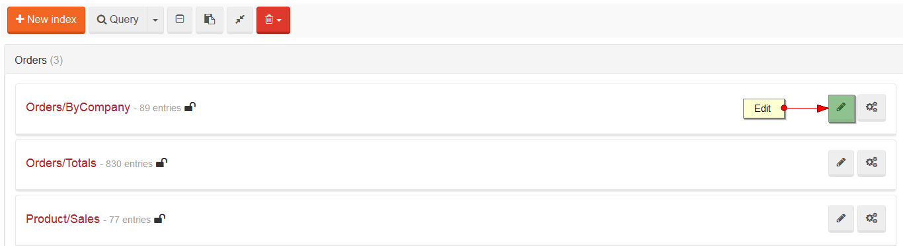
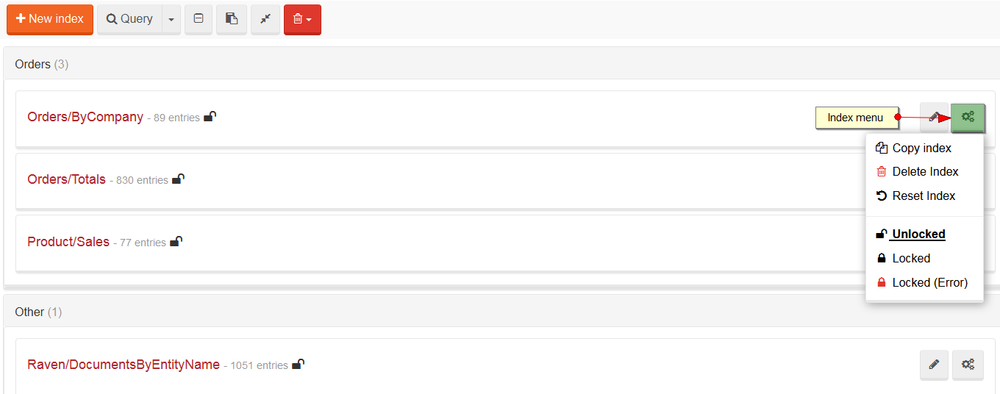
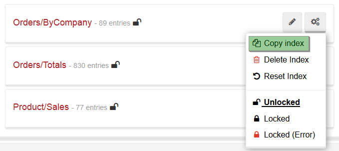
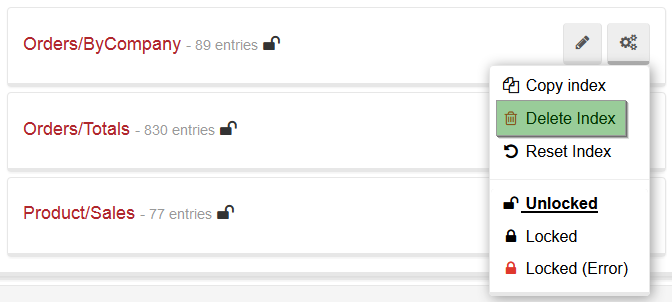

import Admonition from '@theme/Admonition';
import Tabs from '@theme/Tabs';
import TabItem from '@theme/TabItem';
import CodeBlock from '@theme/CodeBlock';
import LanguageSwitcher from "@site/src/components/LanguageSwitcher";
import LanguageContent from "@site/src/components/LanguageContent";

# Indexes: Indexes View

This view lists all available indexes in a current database and gives you the ability to create, edit, query, or delete indexes. Indexes are grouped by a collection they are working on and each index contains basic information, such as a number of indexed entries and locked state.

## Action Bar

Action Bar in this View contains the following capabilities:

- `New Index` - redirects to [Index Edit View](../../../studio/overview/indexes/index-edit-view.mdx) where you can create a new index,
- `Query` - redirects to [Query View](../../../studio/overview/query/query-view.mdx),
- `Collapse All` - collapses all indexes,
- `Paste` - quickly creates index by pasting [IndexDefinition](../../../glossary/index-definition.mdx),
- `Index Merge Suggestions` - retrieves all suggestions for an index merging,
- `Delete` - removes idle/disabled/abandoned/all indexes

  

## Querying

After clicking on an index name you will be navigated to the `Query View`. To read more about querying in Studio, please visit [this](../../../studio/overview/query/query-view.mdx) article.

  

## Editing

To edit index just press the `Edit` button available for each index. This will navigate you to the `Index Edit View` about which you can read [here](../../../studio/overview/indexes/index-edit-view.mdx).

  

## Menu

The following menu actions are available in the index menu:

- `Copy index`,
- `Delete index`,
- `Reset Index`,
- `Unlocked` / `Locked` / `Locked (Error)`

    

---

### Copying

When the `Copy index` button is pressed, the index definition is loaded from a server and a popup from which it can be copied appears. Later on this definition can be used to create a new index with the `Paste` action from  the `Action Bar` (remember to change an index name).

  

---

### Deleting

If you want to delete an index (with the indexing data) press the `Delete index` button in the menu.

  

<Admonition type="danger" title="">
This operation cannot be undone.
</Admonition>

---

### Resetting

Resetting an index will **remove all indexing data and start indexing from scratch**. To reset an index press the `Reset index` button in the menu.

  

<Admonition type="danger" title="">
This operation cannot be undone.
</Admonition>

---

### Locking

You can read more about locking [here](../../../server/administration/index-administration.mdx#index-locking).

