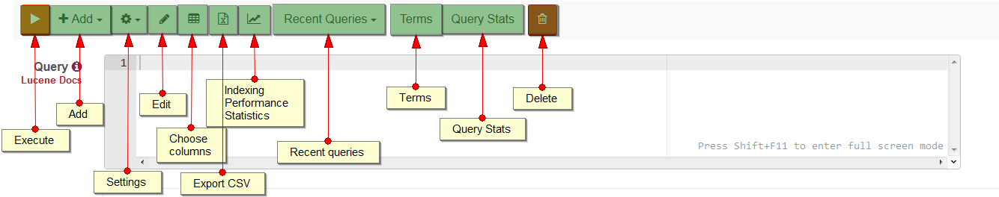
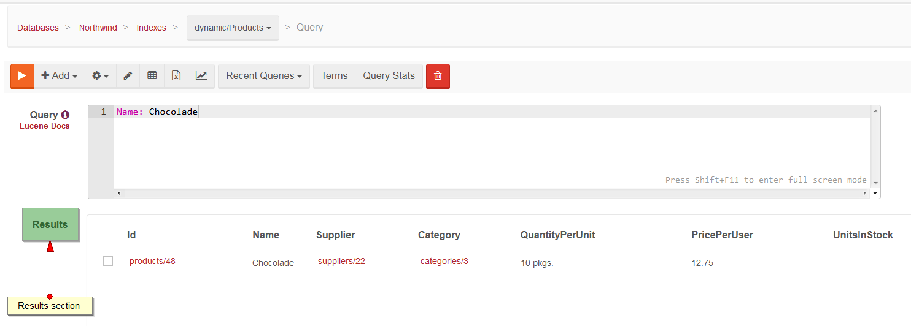
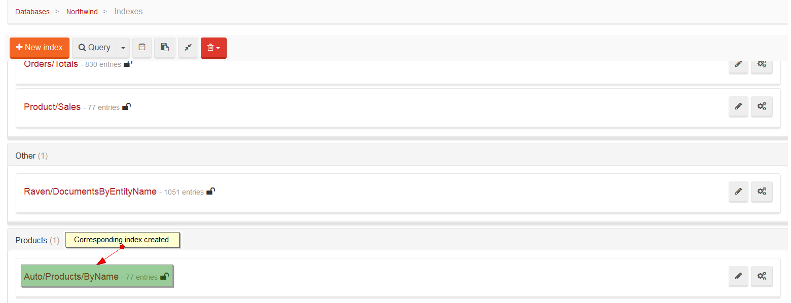

import Admonition from '@theme/Admonition';
import Tabs from '@theme/Tabs';
import TabItem from '@theme/TabItem';
import CodeBlock from '@theme/CodeBlock';
import LanguageSwitcher from "@site/src/components/LanguageSwitcher";
import LanguageContent from "@site/src/components/LanguageContent";

# Query: Query View

This view allows running queries for already existing indexes (click [here](../../../indexes/creating-and-deploying.mdx#static-indexes) to read about static indexes) and running dynamic queries, which can create a new dynamic index (click [here](../../../indexes/creating-and-deploying.mdx#auto-indexes) to read more about dynamic indexes)

## Action Bar

Action Bar consists of the following:

- `Execute` - runs the queries,
- `Add` - adds a transformer or sort option to the query,
- `Settings` - converts implicit operators, toggle field showing or index entries,
- `Edit` - takes you directly to [Index Edit View](../../../studio/overview/indexes/index-edit-view.mdx) where you can edit the index,
- `Choose columns` - allows you to choose columns which will be displayed in `Results`,
- `Export CSV` - exports results to CSV file,
- `Indexing performance statistics` - takes you to [Indexing Performance Chart](../../../studio/overview/status/indexing/indexing-performance.mdx) to view statistics,
- `Recent Queries` - contains a list of recently ran queries,
- `Terms` - navigates to index terms view,
- `Query Stats` - opens a window with statistics for the current query,
- `Delete` - deletes documents that match the query (only Map index)

---

## Querying Static Index

The first step while running queries is choosing an appropriate index from the list of available indexes.

Then, you will need to enter a query that uses Lucene-flavored syntax (more [here](../../../indexes/querying/full-query-syntax.mdx)) that matches appropriate fields defined in selected index,

After running the query using `Execute` from `Action Bar`, query results will be viewed in `Results` section.

---

## Dynamic queries

To run a dynamic query, you need to choose a suitable collection from the list first (e.g. dynamic/Products).

Then, as in the case of static querying, you will need to enter an appropriate query.

Query results, as in the case of static querying, will be displayed in `Results` section.

<Admonition type="warning" title="">
Remember that running dynamic query may create a dynamic index, which can always be viewed using the [Indexes View](../../../studio/overview/indexes/indexes-view.mdx).
</Admonition>

