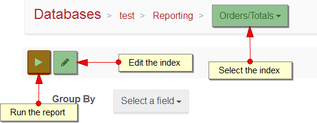
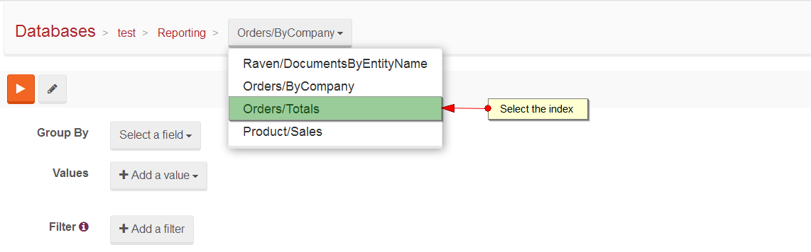

import Admonition from '@theme/Admonition';
import Tabs from '@theme/Tabs';
import TabItem from '@theme/TabItem';
import CodeBlock from '@theme/CodeBlock';
import LanguageSwitcher from "@site/src/components/LanguageSwitcher";
import LanguageContent from "@site/src/components/LanguageContent";

# Query: Reporting View

This view allows to perform report queries on results of existing indexes. Under the hood it works based on [Dynamic aggregation](../../../indexes/querying/dynamic-aggregation.mdx) feature.

## Action Bar

Action Bar consists of the following:

- `Select the index` - first you need to choose an index you want to report on,
- `Run the report` - runs the report on the selected index for a given aggregation values,
- `Edit the index` - enables to edit a definition of the selected index by navigating to [Index Edit View](../indexes/index-edit-view.mdx).

## Aggregation criteria

- `Group By` - name of a field that the report will aggregate by the index results,
- `Values` - names of fields that will be processed by report
- `Filter` - filtering criteria

## Issuing reporting query - example

The first step is selecting the appropriate index:

Next fill the aggregation criteria:

Then run the report. You will see the results:

This is equivalent of doing:

<TabItem value="csharp" label="csharp">
<CodeBlock language="csharp">
{`select EmployeeID, sum(tot.Total) Total from Orders o join 
    (
        select sum((Quantity * UnitPrice) * (1- Discount)) Total, OrderId from [Order Details]
        group by OrderID
    ) tot
    on o.OrderID = tot.OrderID
where o.CustomerID = @CustomerId
group by EmployeeID
`}
</CodeBlock>
</TabItem>

In code, this would look something like this:

<TabItem value="sample_csharp" label="sample_csharp">
<CodeBlock language="csharp">
{`session.Query<Order>("Orders/Total")
	.Where(x => x.Company == "companies/1")
	.AggregateBy(x => x.Employee)
	.SumOn(x => x.Total)
	.ToList();
`}
</CodeBlock>
</TabItem>

