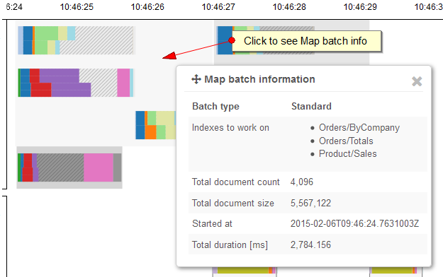
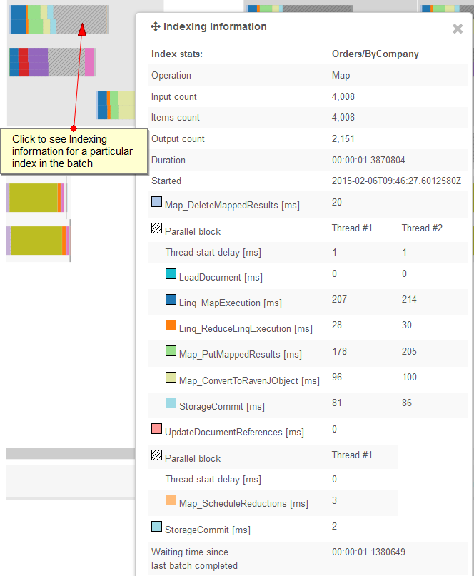
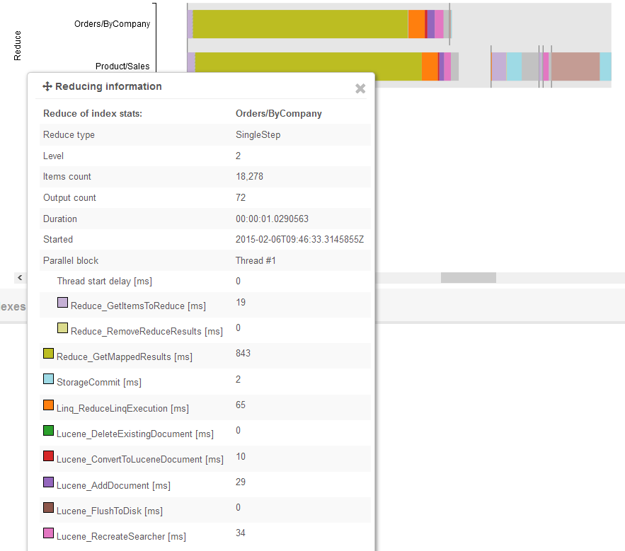

import Admonition from '@theme/Admonition';
import Tabs from '@theme/Tabs';
import TabItem from '@theme/TabItem';
import CodeBlock from '@theme/CodeBlock';
import LanguageSwitcher from "@site/src/components/LanguageSwitcher";
import LanguageContent from "@site/src/components/LanguageContent";

#Indexing performance

`Indexing performance` tab provides you with indexing timeline chart:

On the X axis, you have time. The Y axis is for different indexes. Note that the top part is for map operations, while the bottom part is for reduce operations and that they are running in parallel. 
Even some index processing parts are run in parallel what is also reflected on the chart.

Indexes and reduces that had been run in the same batch are grouped and presented in a single batch box. You can see when particular indexes were run in batch and how long each of them lasted.

Once you click in the batch box you will see `Map batch information` dialog:

If you want to get details about indexing of a particular index you need to click on it:

This dialog contains all actual timings for the selected index run and legend that explains what particular colors mean. Note that parts executed in parallel contains measures for an each thread.

Analogous dialog you will see after you click on reducing run:

When it comes to reduces, you may notice that there appear some vertical lines on the chart. They split the different reducing phases. Generally the reduction is a multi-step process:

* Level 0
* Level 1
* Level 2

However we also have some optimization that causes that for small number of reduction keys we go directly Level 2 and do single-step reduction (see [Raven/NumberOfItemsToExecuteReduceInSingleStep](../../../../server/configuration/configuration-options.mdx) setting).
Also after reducing we have a post-reducing work where we delete scheduled reductions that we have just processed. Take a look at the following image that distinguishes
reduction phases:

Each of the marked boxes is separately clickable to achieve detailed info about an appropriate phase.

## Available measures

| Color | Measure name | Description|
| ------------- | ----- |
| #17becf | LoadDocument | Time spent on [LoadDocument](../../../../indexes/indexing-related-documents.mdx) calls. |
| #1f77b4 | Linq_MapExecution | Time spent on executing Linq according to Map statement in an index definition. |
| #ff7f0e | Linq_ReduceLinqExecution | Time spent on executing Linq according to Reduce statement in an index definition. |
| #2ca02c | Lucene_DeleteExistingDocument | Time spent on deleting existing Lucene documents (index entries). |
| #d62728 | Lucene_ConvertToLuceneDocument | Time spent on creating a Lucene document based on an indexing result.  |
| #9467bd | Lucene_AddDocument | Time spent on adding a document to Lucene index. |
| #8c564b | Lucene_FlushToDisk | Time spent on flushing Lucene index to a disk.|
| #e377c2 | Lucene_RecreateSearcher | Time spent on recreating index searcher after adding new entries. |
| #aec7e8 | Map_DeleteMappedResults | Time spent on deleting mapped results if they existed for currently indexed documents. |
| #e0e5a3 | Map_ConvertToRavenJObject | Time spent on creating JSON object (RavenJObject) for mapped result. |
| #98df8a | Map_PutMappedResults | Time spent on storing mapped result in a storage engine. |
| #ffbb78 | Map_ScheduleReductions | Time spent on adding scheduled reduction records to a transactional storage during map phase. |
| #c5b0d5 | Reduce_GetItemsToReduce | Time spent on fetching items to reduce from a storage. |
| #c49c94 | Reduce_DeleteScheduledReductions | Time spent on deleting scheduled reduction records. |
| #f7b6d2 | Reduce_ScheduleReductions | Time spent on scheduling reductions of higher levels by storing them in a transactional storage.|
| #bcbd22 | Reduce_GetMappedResults | Time spent on retrieving mapped results from a storage. |
| #dbdb8d | Reduce_RemoveReduceResults | Time spent on removing reducing results from a storage. |
| #9edae5 | StorageCommit | Time spent on committing data to transactional storage.|
| #ff9896 | UpdateDocumentReferences | Time spent on updating document references if an index uses [LoadDocument](../../../../indexes/indexing-related-documents.mdx) calls. |
| #55fa9a | Extension_Suggestions | Time spent on calculation index suggestions. |

